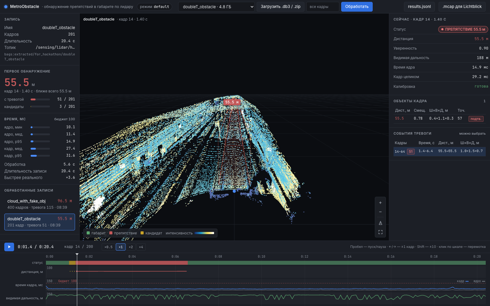

# metro-obstacle — посторонние объекты в габарите поезда метро по 3D-лидару

**Результат (режим `default`):**

- ложные тревоги: 0 событий/км на 5 пустых записях хакатона (2.14 км), 0.4 события/км на новой записи заказчика (13.2 км) — против 22.9 и 25.7 у чистой геометрии;
- дальность: реальный человек ~56 м с первого кадра после прогрева; синтетика — человек и тележка 67 м, куб 2×2 м заказчика 96.5 м;
- 10 Гц, каждый кадр: в ноде на x86 p50 35.6 / p95 60.4 мс (921 600 точек), ~2 ядра CPU вместе с bag play, без GPU;
- непрерывный 20-минутный прогон ноды (13.2 км): время кадра p50 21.8 / p95 29.7 мс без роста, 0.6 ложного события/км, память ноды ~0.26 ГБ. Прогон шёл с глубиной очереди входа 1: 6.5% кадров не дошло до ноды из-за нехватки памяти у `ros2 bag play` (WSL, 16 ГБ); исправлено `input_depth: 5`, повтор на x86 не делали. Цифра 0.4 события/км выше — прогон стенда по всей записи ([EXPERIMENTS](docs/EXPERIMENTS.md#длительная-работа)).

ROS 2-решение (Humble, Docker), которое на каждый кадр лидара отвечает на вопрос «есть ли
на пути поезда что-то, чего там быть не должно»: статус «свободно / кандидат /
препятствие», расстояние вдоль пути до ближайшего подтверждённого объекта и список
объектов с положением, размерами, числом точек и уверенностью. Без карты линии и без
одометрии: нода сама находит топик облака и направление «вперёд», калибрует положение
лидара по полотну (и уточняет калибровку на ходу), строит ось пути по рельсам и стенам,
учит «нормальный» профиль полотна и ищет в габарите всё, что в эту норму не вписывается.
Кандидатов проверяет классификатор LightGBM «объект или фон тоннеля» по 9 признакам
кластера (обучен на случайных формах, а не на типах объектов); тревога подтверждается по
3 кадрам из 5 с учётом пройденного пути. Подход выбран по сравнению 20+ вариантов на
данных хакатона, синтетике и данных заказчика, см. [docs/ALGORITHM.md](docs/ALGORITHM.md).

## Быстрый старт

Нужен только Docker. Проверочная платформа — x86_64, Ubuntu 22.04. Bag — в формате
rosbag2: каталог с `metadata.yaml` и `*.db3` (как в данных хакатона).

```bash
docker build -t metro-obstacle .                                   # 1. образ, ~1.5 мин
docker run --rm --net=host -v /path/to/bags:/data metro-obstacle \
  ros2 launch metro_obstacle detect.launch.py bag:=/data/<bag>     # 2–3. детектор + bag play
ls /path/to/bags/out/                                              # 4. results_<bag>_<время>.jsonl
```

Нода прогревается, пишет `detector ready`, после этого launch сам запускает
`ros2 bag play`; когда bag закончился, контейнер завершается. В логе при старте должно быть
`verifier on: ... (threshold 0.7978)` и `mode=default`. Ниже — то же подробно и по шагам.

### 1. Сборка

```bash
docker build -t metro-obstacle .
```

Образ содержит ROS 2 Humble, ядро детектора с моделью классификатора и ROS-пакеты; ядра
numba компилируются при сборке и кладутся в кэш образа; сборка падает, если режим
`default` не загрузил классификатор. Образ x86 — 1.24 ГБ. Подробности сборки (в том числе
amd64 на Mac) — [docs/RUN.md](docs/RUN.md#сборка).

### 2. Запуск: детектор + проигрывание bag одной командой

```bash
docker run --rm --net=host -v /path/to/bags:/data metro-obstacle \
  ros2 launch metro_obstacle detect.launch.py bag:=/data/<bag>
```

`<bag>` — имя каталога bag внутри `/path/to/bags`, например `doubleT_obstacle`. Нода
прогревает ядро, пишет в лог `detector ready`, после этого launch запускает
`ros2 bag play`; когда bag закончился, контейнер завершается сам. Результат —
`/path/to/bags/out/results_<bag>_<YYYYmmdd-HHMMSS>.jsonl`.

### 3. Тот же сценарий по шагам: `docker run` → `ros2 bag play` → результат

Терминал 1 — детектор (без аргумента `bag` он ждёт любой топик `sensor_msgs/PointCloud2`):

```bash
docker run --rm --name metro-det --net=host --ipc=host \
  -v "$PWD/out":/data/out metro-obstacle
```

Терминал 2 — после строки `detector ready` в логе первого терминала проиграть bag.
Из того же образа (ROS на хосте не нужен):

```bash
docker run --rm --net=host --ipc=host -v /path/to/bags:/data/bags:ro metro-obstacle \
  ros2 bag play /data/bags/<bag> --read-ahead-queue-size 10
```

или на хосте с ROS 2 Humble: `ros2 bag play /path/to/bags/<bag>`.

Терминал 3 — смотреть результат вживую:

```bash
docker exec -it metro-det bash -lc 'source /ws/install/setup.bash && \
  ros2 topic echo /obstacle_detection/status'
```

Результат пишется в `./out/results_<топик>_<время>.jsonl` (имя — по топику, в данных
хакатона `lidar_points` или `sensing_lidar_hesai128_pointcloud`). Детектор в этом
режиме не завершается сам (Ctrl+C — чистое завершение, файл результатов закрывается);
следующий bag можно проигрывать на ту же ноду — она сама переподпишется и начнёт с чистой
калибровки, в новый файл.

`--ipc=host` нужен, когда издатель в другом контейнере или на хосте: Fast DDS на одном
хосте передаёт облака через разделяемую память. `ROS_DOMAIN_ID` у всех участников
должен совпадать. `--read-ahead-queue-size 10` ограничивает память плеера (кадр —
около 9 МБ).

### 4. Визуализация (RViz)

На Linux с X11 — детектор, bag по кругу и RViz одним сервисом:

```bash
xhost +local:docker
BAGS_DIR=/path/to/bags BAG=doubleT_obstacle docker compose up demo
```

В RViz: облако (цвет по интенсивности), коридор габарита (зелёный — свободно, жёлтый —
кандидат, красный — препятствие), рамки объектов, подпись `CLEAR` или
`OBSTACLE 56.3 m`. Ограничения macOS и запуск RViz на хосте — в
[docs/RUN.md](docs/RUN.md#rviz).

Без ROS и без X11 (например, на Mac) запись можно выгрузить в MCAP и смотреть в Lichtblick
или Foxglove: `bench/to_mcap.py` прогоняет то же ядро и пишет облако, коридор, рамки и
статус; раскладка — `docs/lichtblick_layout.json`
([docs/RUN.md](docs/RUN.md#без-ros-запись--mcap-для-lichtblick--foxglove)).

### 5. Веб-прототип: загрузить запись и посмотреть результат в браузере

```bash
BAGS_DIR=/path/to/bags docker compose build web   # образ без ROS, ~0.85 ГБ
BAGS_DIR=/path/to/bags docker compose up web      # записи из /path/to/bags — в списке
# открыть http://localhost:8080 → выбрать запись или загрузить .db3 / .zip → «Обработать»
```



Запись прогоняется через то же ядро (режим `default`) покадрово, без ROS и без ожидания
реального времени (`doubleT_obstacle`, 201 кадр, — около 5 с). Слева — 3D-вид кадра:
облако (цвет по интенсивности), коридор габарита, рамки объектов с дистанцией; мышь —
вращение и зум, под видом — слайдер кадров и проигрывание. Справа — статус кадра
(«ПУТЬ СВОБОДЕН» / «ПРЕПЯТСТВИЕ 55.5 м»), объекты кадра, сводка по записи (кадры с
тревогой, первое обнаружение, время кадра), график дистанции по кадрам и таблица событий
тревоги; клик по графику или событию — переход к кадру. Скачать: `results.jsonl` (формат
как у ноды) и `.mcap` для Lichtblick. Тот же функционал — HTTP API, описание в
[docs/RUN.md](docs/RUN.md#веб-прототип). Страница работает без интернета: three.js r160
(лицензия MIT, `web/static/vendor/LICENSE-three.txt`) лежит в репозитории.

### Видео

**[metro-obstacle-demo.mp4](https://drive.google.com/file/d/1u5tiwy09KhiPsfsCfY2mH-QTezr2SuZ-/view?usp=sharing)**
(50 с, записано через веб-прототип, три ракурса камеры): реальный человек на пути на
~56 м — тревога, дистанция, уход человека и «путь свободен»; пустой тоннель без тревог;
синтетика заказчика — куб 2×2 м и объект 0.3 × 0.3 м на пути.

## Что публикуется

Все выходы — в `frame_id` входного облака. Нода публикует тождественный статический TF
`<frame облака>` → `lidar_link`, поэтому фиксированный фрейм RViz — всегда `lidar_link`.

| топик | тип | содержание |
|---|---|---|
| `/obstacle_detection/status` | `metro_obstacle_msgs/ObstacleStatus` | итог кадра (поля ниже), на каждый обработанный кадр |
| `/obstacle_detection/obstacles` | `metro_obstacle_msgs/ObstacleArray` | объекты кадра, ближние первыми |
| `/obstacle_detection/detections` | `vision_msgs/Detection3DArray` | те же объекты в стандартном типе (рамка, `score` = confidence) |
| `/obstacle_detection/markers` | `visualization_msgs/MarkerArray` | коридор габарита, рамки объектов, подписи дистанций |
| `/diagnostics` | `diagnostic_msgs/DiagnosticArray` | частота входа и выхода, время обработки (последнее и p95), пропущенные и сбойные кадры, длина коридора, калибровка, загружен ли классификатор (WARN, если нет) |

Поля `ObstacleStatus`:

| поле | смысл |
|---|---|
| `obstacle` | `true` — в габарите подтверждённое препятствие (`level == 2`) |
| `distance` | м вдоль пути до ближайшего подтверждённого объекта; `NaN`, если его нет |
| `confidence` | 0..1: у ближайшего подтверждённого; если подтверждённых нет — наибольшая среди кандидатов; 0, когда свободно |
| `level` | 0 — свободно, 1 — есть кандидаты, ещё не подтверждённые по кадрам, 2 — препятствие подтверждено |
| `visible_range` | м — докуда построен коридор габарита (длина прослеженной оси пути) |
| `processing_ms` | полное время кадра в ноде: разбор облака + детектор |
| `mode` | фактический режим детектора: `default` / `geometry` / `strict` / `soft` (`geometry` и при откате `default` без классификатора) |
| `calibrated` | `false` — ядро ещё калибруется, тревоги не подтверждаются |

Поля объекта (`Obstacle`): `distance` (м вдоль пути до ближней точки), `lateral`
(смещение от оси пути, + влево), `height` (верх над уровнем головок рельсов),
`length`, `width`, `points`, `confidence`, `confirmed`, `position` (центр рамки в осях
облака), `z_extent` (вертикальный размер точек; у висящего кабеля мал при большом
`height`). Определения и формула `confidence` — в
[docs/ALGORITHM.md](docs/ALGORITHM.md#выход-и-уверенность).

## Файл результатов `results_*.jsonl`

Одна строка JSON на обработанный кадр. По умолчанию в образе пишется в каталог
`/data/out/`: на каждый источник (bag или топик) свой файл
`results_<имя>_<YYYYmmdd-HHMMSS>.jsonl`, прошлые прогоны не затираются.

```json
{"stamp": 946692903.133367, "frame": 5, "obstacle": true, "distance": 56.3,
 "confidence": 0.9, "level": 2, "visible_range": 121.0, "mode": "default",
 "calibrated": true, "obstacles": [{"distance": 56.3, "lateral": 0.2, "height": 1.7,
 "length": 0.4, "width": 0.6, "points": 38, "confidence": 0.9, "confirmed": true,
 "position": [0.1, -56.9, -0.1], "z_extent": 1.6}], "processing_ms": 27.1,
 "core_ms": 21.4}
```

`stamp` — время кадра из заголовка PointCloud2; `frame` — номер кадра от начала
источника; `processing_ms` — полное время кадра в ноде, `core_ms` — только детектор;
`null` — значения нет (например, `distance`, когда путь свободен). Остальные поля —
как в `ObstacleStatus` и `Obstacle` выше.

Кадры с тревогой (на хосте нужен только Python 3):

```bash
python3 -c 'import json,sys
for l in open(sys.argv[1]):
    r = json.loads(l)
    if r["obstacle"]: print(r["frame"], r["distance"], r["confidence"])' out/results_<имя>_<время>.jsonl
```

Сводка по файлу (задержка p50/p95, моменты появления и снятия тревоги), шаблоны имени
файла и режим дописывания — [docs/RUN.md](docs/RUN.md#как-смотреть-результат).

## Параметры

Основное задаётся аргументами launch (`имя:=значение`):

| аргумент | по умолчанию | смысл |
|---|---|---|
| `bag` | — | путь к bag; пусто — слушать живой топик |
| `mode` | `default` | `default` — основной: геометрия + классификатор + 3 из 5; `geometry` — только геометрия (прежний основной); `strict` — геометрия без раздвоенных лучей; `soft` — 2 из 5, дальше по крупным объектам, больше ложных |
| `verify_model` | модель из пакета | свой файл модели классификатора (LightGBM, текст); путь внутри контейнера |
| `input_topic` | авто | топик PointCloud2; пусто — первый найденный топик этого типа |
| `forward_axis` | `auto` | ось «вперёд» в осях лидара: `auto`, `x`, `-x`, `y`, `-y` |
| `results_path` | `/data/out/` | каталог, шаблон `{name}`/`{time}` или файл для JSON Lines; `none` — не писать |
| `rate`, `loop`, `exit_after_bag` | `1.0`, `false`, `true` | проигрывание bag |
| `rviz` | `false` | запустить RViz (нужен демо-образ) |
| `params_file` | `config/default.yaml` | файл параметров ноды |
| `fake_core` | `false` (или `METRO_FAKE_CORE`) | фиктивное ядро — только для проверки ROS-обвязки |

В `config/default.yaml` дополнительно: габарит (`gauge_half_width` = 1.05 м,
`gauge_height` = 3.0 м над полотном, то есть 2.74 м над головками рельсов), `max_range`,
надёжность подписки (`input_reliability`), глубина очереди входа (`input_depth` = 5), имя источника в имени файла, публикация TF. Полные таблицы и пример
своего файла параметров — [docs/RUN.md](docs/RUN.md#аргументы-launch). Переменные
`docker compose`: `BAGS_DIR`, `BAG`, `OUT_DIR`, `MODE`, `RATE`, `DEMO_BASE_IMAGE`,
`METRO_FAKE_CORE`, `LIBGL_ALWAYS_SOFTWARE` (основные описаны в начале `docker-compose.yml`).

Внутренние параметры алгоритма (пороги, подтверждение M из N, модель полотна,
классификатор, уточнение плоскости) и режимы описаны в
[docs/ALGORITHM.md](docs/ALGORITHM.md#параметры); их значения —
`metro_obstacle_core/src/metro_obstacle_core/params.py`. Эти поля задаются режимом ядра, не
аргументами launch. Во всех режимах поправка высоты по рельсам вдали ограничена ±0.05 м
(`delta_clip`), модель полотна прогревается 15 кадров (`warmup_frames`, около 1.5 с после
старта тревоги не подтверждаются), а плоскость полотна после первого кадра уточняется на
ходу с гистерезисом 1° / 5 см (`plane_every`, `plane_tol_deg`, `plane_tol_d`).

## Результаты

Цифры финального прогона сдаваемого кода — в [docs/EXPERIMENTS.md](docs/EXPERIMENTS.md)
(методика, данные, честная оценка классификатора, таблицы по дальности, синтетика
заказчика, ложные тревоги, скорость и ресурсы, сложные случаи, история улучшений, что не
сработало).

| показатель | `default` | `geometry` |
|---|---|---|
| ложные тревоги, 5 пустых записей хакатона (2.14 км): % кадров / событий на км; модель без проверяемой записи | **0.0% / 0** | 3.7% / 22.9 |
| ложные тревоги, новая реальная запись заказчика (13.2 км, 11 271 кадр, 12 точек старта) | **0.04% / 0.4** | 9.2% / 25.7 |
| наша синтетика, устойчивое обнаружение (3 кадра подряд, медиана), м: человек / тележка / коробка 0.5 м / кабель Ø20 мм | 67 / 67 / 61 / 55 | 67 / 67 / 64 / 66 |
| то же: столбик 10×30 см / объект 300×100 мм, м | 33 / 17 | 43 / 32 |
| синтетика заказчика, первое подтверждение, м: куб 2×2 по центру / 0.3×0.3 по центру / 0.3×0.3 на рельсе / 2×0.2 на рельсах | 96.5 / 35.7 / 23.1 / 50.4 | 96.7 / 49.2 / 35.6 / 80.6 |
| синтетика заказчика: объекты за габаритом и над ним | тревог нет | ложная на кубе над габаритом (28 кадров) |
| реальный человек в `doubleT_obstacle` (~56 м) | с первого кадра после прогрева (кадр 14), других тревог нет; в ноде на x86 с глубиной очереди 1 — 48 кадров с тревогой (нода получила 197 кадров из 201) | с первого кадра после прогрева (кадр 14) |
| полное время кадра в ноде, Docker, x86 (i5-10600KF): p50 / p95, мс | 35.6 / 60.4 (921 600 точек); 35.5 / 43.8 (307 тыс.) | — |
| ресурсы | ~2 ядра CPU с проигрыванием bag (~0.5 на 307 тыс. точек), ~0.7 ГБ памяти контейнера на коротком bag (в длительном прогоне память контейнера растёт до ~7 ГБ за счёт `ros2 bag play`, нода ~0.26 ГБ), GPU не используется; 10 Гц — каждый кадр | — |
| 20-минутный непрерывный прогон ноды (новая запись, 13.2 км) | p50 21.8 / p95 29.7 мс, без роста; 8 событий (0.6/км); нода ~0.26 ГБ; сбойных кадров 0. Глубина очереди 1: 6.5% кадров не дошло до ноды из-за памяти `ros2 bag play` (WSL, 16 ГБ), исправлено `input_depth: 5`, повтор на x86 не делали; 0.4/км в строке выше — прогон стенда по всей записи | — |

Дальности — на синтетике: нашей (объекты вставлены трассировкой лучей по сетке лидара в
реальные кадры) и заказчика; ложные тревоги, человек и время — на реальных записях.
`default` находит мелкие и тонкие объекты ближе, чем `geometry`, — это цена снижения
ложных тревог на реальных данных в 60 раз по событиям на км.

## Ограничения

- **Физика лидара ограничивает дальность по мелким объектам.** На объект 300×100 мм за
  кадр (с обоими отражениями) попадает в среднем около 25 точек на 20–40 м, 9 на 40–60 м и
  2 на 80–100 м: дальше 80 м он виден лишь в 25–40% кадров. Крупные объекты (человек,
  тележка) дают десятки точек и на 100–125 м.
- **Объект 300×100 мм — на пределе метода.** Его высота 10 см над головкой рельса почти
  равна порогу высоты над нормой полотна; `default` находит его устойчиво с 17 м
  (медиана), `geometry` с раздвоенными лучами — с 32 м.
- **Классификатор срезает часть мелкого вдали.** Мелкие и тонкие объекты `default` находит
  ближе, чем `geometry`; тонкий стержень, висящий с потолка у самого верха габарита
  (синтетика заказчика), не подтверждается — он похож на потолочные конструкции, которые
  давали почти все ложные тревоги геометрии. Классификатор обучен на фоне пяти записей
  хакатона и случайных формах нашего генератора; на другой конструкции тоннеля фон может
  отличаться. Без `lightgbm` режим `default` откатывается в `geometry` (WARN в логе и в
  `/diagnostics`).
- **Кромка габарита.** Коридор сужен на запас на ошибку оси (5 см + 1 мм на метр
  дальности): объект, заходящий в габарит у края на несколько сантиметров (куб 2×2 м
  заказчика, 7–9 см), не находится. Расширять коридор нельзя: в реальных тоннелях
  оборудование стоит в 0.93–1.04 м от оси.
- **Повороты тоннеля ограничивают прямую видимость примерно 130 м.** Дальше лидар видит
  стену поворота, а не путь. На сдвоенных тоннелях, у платформ и на переходах между
  типами тоннеля ось пути может обрываться раньше: стены перестают согласовываться.
- **300 м на этих тоннелях недостижимы** ни для какого алгоритма: пути в прямой
  видимости столько нет, а точек на объекте на такой дальности почти нет.
  Поле `visible_range` на каждый кадр честно говорит, докуда коридор реально проверен.
- **Предметы ниже уровня головок рельсов не ищутся**: опорный уровень полотна не ниже
  головок рельсов, иначе рельсы, лоток и шпалы давали бы ложные тревоги.
- **Реальный объект в данных один** — человек в `doubleT_obstacle`. Остальное качество по
  объектам измерено на синтетике — нашей (трассировка лучей; пятно луча и раздвоенные
  отражения — допущения генератора) и заказчика.
- Автокалибровка и ось по рельсам проверены на двух положениях лидара из данных
  хакатона и на данных заказчика; режим `geometry` использует второе отражение лучей (dual
  return) — без него ведёт себя как `strict`; `default` второе отражение не использует.

Подробно, с причинами — [docs/ALGORITHM.md](docs/ALGORITHM.md#ограничения-и-слабые-места).

## Структура репозитория

```
.
├── Dockerfile, docker-compose.yml   образ решения; compose: detect, demo (RViz), web
├── Dockerfile.web                   образ веб-прототипа (ядро + rosbags, без ROS)
├── web/                             веб-прототип: HTTP API (stdlib) и страница (three.js локально)
├── docker/                          entrypoint, точные версии numpy/numba для образа
├── metro_obstacle_core/             ядро детектора без ROS (Python, numpy, numba, lightgbm)
│   └── src/metro_obstacle_core/     detector, calib, axis, floor, speed, verifier, kernels, params
│       └── models/verifier.txt      модель проверяющего классификатора
├── ros2_ws/src/
│   ├── metro_obstacle/              ROS 2-нода, launch, config (default.yaml, RViz), viz, тесты
│   └── metro_obstacle_msgs/         ObstacleStatus, Obstacle, ObstacleArray
├── tests/                           тесты ядра, сверка со стендом, замер скорости
├── bench/                           стенд: кэш bag, синтетика, метрики, прототипы, классификатор, данные заказчика, MCAP
└── docs/                            RUN, ARCHITECTURE, ALGORITHM, EXPERIMENTS, графики, раскладка Lichtblick
```

Ядро — одна библиотека для ROS-ноды и стенда: цифры экспериментов относятся ровно к
сдаваемому коду (сверка режимов геометрии с прототипом стенда — `tests/parity.py`).

## Документация

- [docs/RUN.md](docs/RUN.md) — сборка, запуск, все параметры, классификатор, RViz, MCAP, тесты.
- [docs/ARCHITECTURE.md](docs/ARCHITECTURE.md) — компоненты, поток данных, интерфейсы,
  жизненный цикл ноды, производительность, развёртывание.
- [docs/ALGORITHM.md](docs/ALGORITHM.md) — алгоритм по шагам, классификатор, формулы и
  сводная математическая модель, параметры и режимы, ограничения, что пробовали и почему
  отказались.
- [docs/EXPERIMENTS.md](docs/EXPERIMENTS.md) — эксперименты: дальность, задержка,
  частота, CPU/GPU, ложные тревоги, данные заказчика, сложные ситуации, история
  улучшений, что не сработало.
- [bench/README.md](bench/README.md) — стенд: карта скриптов, гипотезы и их итог.

## Тесты

```bash
# ROS-пакет в образе (разбор облака, сообщения, сквозной кадр через ядро)
docker run --rm metro-obstacle bash -c \
  'cd /ws/src/metro_obstacle && python3 -m pytest -q -p no:cacheprovider test'
# ядро без Docker (Python >= 3.10); rosbags и mcap-ros2-support — для тестов MCAP и веба
pip install ./metro_obstacle_core pytest rosbags mcap-ros2-support && python3 -m pytest -q tests
```

Регрессионные тесты на реальных кадрах пропускаются, если нет кэша стенда.
