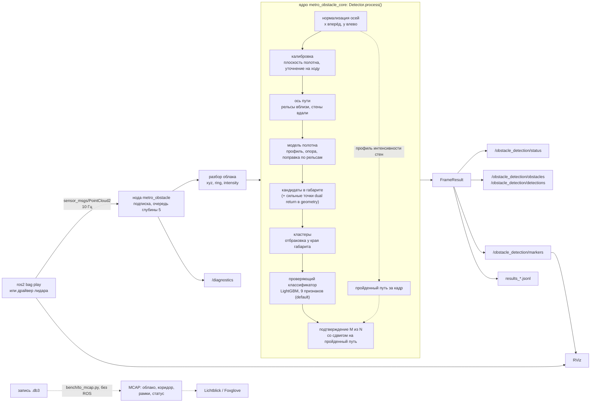
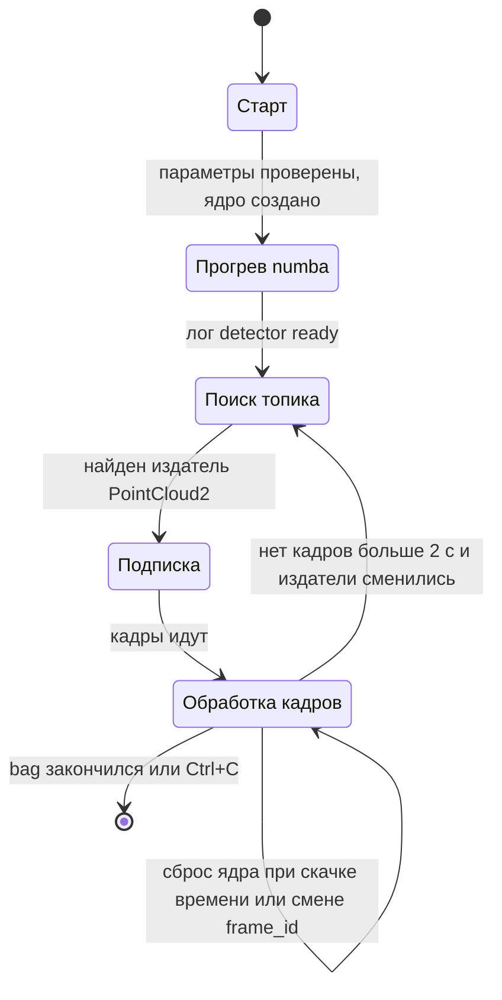

# Архитектура

Решение состоит из ядра детектора без ROS, тонкой ROS 2-ноды вокруг него, пакета
сообщений и Docker-образа. Ядро одно и то же для ноды и для стенда экспериментов,
поэтому цифры экспериментов относятся ровно к сдаваемому коду.

## Компоненты

| компонент | где | ответственность | стек |
|---|---|---|---|
| ядро `metro_obstacle_core` | `metro_obstacle_core/src/metro_obstacle_core/` | весь алгоритм на кадр: оси, калибровка, ось пути, модель полотна, кандидаты, кластеры, проверяющий классификатор, подтверждение; состояние между кадрами; модель классификатора в пакете | Python ≥ 3.10, numpy, numba, lightgbm |
| ROS-пакет `metro_obstacle` | `ros2_ws/src/metro_obstacle/` | нода: поиск топика, подписка, разбор PointCloud2, вызов ядра, публикация, диагностика, файл результатов; launch; конфиг параметров и RViz | rclpy, ament_python |
| сообщения `metro_obstacle_msgs` | `ros2_ws/src/metro_obstacle_msgs/msg/` | `ObstacleStatus`, `Obstacle`, `ObstacleArray` | rosidl, ament_cmake |
| образ | `Dockerfile`, `docker/`, `docker-compose.yml` | ROS 2 Humble + ядро + пакеты; прогретый кэш numba; сервисы `detect` и `demo` (RViz) | Docker |
| стенд | `bench/` | кэш bag, синтетика трассировкой лучей, метрики, прототипы всех сравнённых вариантов, обучение классификатора, прогоны на данных заказчика, выгрузка в MCAP (`to_mcap.py`) | Python, rosbags, lightgbm, matplotlib, mcap |
| тесты | `tests/`, `ros2_ws/src/metro_obstacle/test/` | юнит-тесты ядра и ноды, регрессия на реальных кадрах, сверка ядра со стендом | pytest |

Модули ядра:

| модуль | что делает |
|---|---|
| `detector.py` | `Detector.process()` — конвейер кадра, подтверждение по кадрам, сборка результата (`FrameResult`, `Obstacle`) |
| `calib.py` | ось «вперёд» по облаку, плоскость полотна (RANSAC, уточнение МНК), выравнивающий поворот |
| `axis.py` | ось пути: рельсы вблизи, стены вдали, RANSAC-кубика; высота полотна вдоль оси |
| `floor.py` | модель полотна: профиль поперёк пути, опорный уровень, поправка Δ(s) |
| `speed.py` | пройденный за кадр путь по сдвигу профиля интенсивности стен |
| `verifier.py` | проверяющий классификатор: признаки кластера, загрузка модели LightGBM (один раз на процесс), ошибка загрузки `VerifierError` |
| `models/verifier.txt` | модель классификатора (текст LightGBM booster), ставится вместе с пакетом |
| `kernels.py` | горячие циклы на numba |
| `params.py` | параметры и режимы `default` / `geometry` / `strict` / `soft`, режим отката `FALLBACK_MODE = geometry` |
| `synthetic.py` | простая синтетическая сцена для прогрева numba и юнит-тестов |

Модули ноды:

| модуль | что делает |
|---|---|
| `detector_node.py` | нода: параметры, прогрев, поиск и подписка, обработка кадра, публикация, диагностика |
| `cloud.py` | PointCloud2 → numpy без поточечного цикла; кольца по углу места, если нет поля `ring` |
| `core.py` | выбор ядра (настоящее или фиктивное для проверки обвязки), прогрев, строка лога о классификаторе |
| `source.py` | правила сброса ядра и переподписки при смене источника (без ROS, покрыто тестами) |
| `viz.py` | геометрия маркеров без ROS: коридор габарита, рамки, подписи, цвета (общая для ноды и `bench/to_mcap.py`) |
| `messages.py`, `geometry.py` | результат ядра → сообщения статуса, объектов, `vision_msgs`, маркеры RViz |
| `results_log.py` | запись `results_*.jsonl` |
| `fake_core.py` | фиктивное ядро — только для проверки ROS-обвязки |

## Поток данных

Цепочка: **bag (или драйвер лидара) → облако `PointCloud2` → нода и ядро детектора →
результат (топики, `results_*.jsonl`) → визуализация (RViz; без ROS — MCAP для
Lichtblick / Foxglove)**.

Порядок на кадр:

1. **Приём.** Подписка KEEP_LAST с очередью глубины 5 (`input_depth`): в норме очередь
   пуста (кадр — обычно 20–40 мс, p95 до ~60 мс на 921 600 точек, при периоде 100 мс), пачки кадров от источника разбираются без
   потерь; если ядро не успевает, старые кадры вытесняются новыми.
2. **Разбор облака** (`cloud.py`). Структурированный вид на буфер сообщения без
   копирования; `x, y, z`, `intensity` (если есть), `ring` — из поля или восстанавливается
   по углу места (гистограмма углов с шагом 0.02°, кольцо = связная группа ячеек).
3. **Ядро** (`Detector.process`). Вход — точки в осях сообщения, выход — `FrameResult`:
   статус, дистанция, объекты, коридор для отрисовки. Внутри ядро работает в
   нормализованных осях и переводит выходную геометрию обратно в оси сообщения.
   Шаги — в [ALGORITHM.md](ALGORITHM.md). Классификатор режима `default` — внутри ядра:
   вход — признаки кластеров текущего кадра, выход — оценка на каждый; кластеры ниже
   порога отбрасываются до подтверждения по кадрам (около 0.1 мс на кадр).
4. **Публикация.** Статус и объекты публикуются всегда; ошибка при сборке маркеров или
   `vision_msgs` пишется в лог и не прерывает работу детектора.
5. **Файл результатов.** Строка JSON на кадр, построчная буферизация: файл пригоден для
   разбора, даже если прогон оборван.
6. **Визуализация.** RViz подписывается на облако и маркеры (`config/metro_obstacle.rviz`).
   Без ROS — `bench/to_mcap.py`: та же запись `.db3` прогоняется через ядро, маркеры
   строятся тем же `viz.py`, что и в ноде, и пишутся в MCAP вместе с облаком и статусом;
   раскладка Lichtblick / Foxglove — `docs/lichtblick_layout.json`
   ([RUN.md](RUN.md#без-ros-запись--mcap-для-lichtblick--foxglove)).
7. **Диагностика** — раз в секунду, независимо от кадров.

Если при разборе или в ядре на кадре возникло исключение, кадр пропускается и
учитывается в `frames_failed`; нода продолжает работу.

## Интерфейсы

### Вход

Любой топик `sensor_msgs/PointCloud2` с полями `x, y, z` (float32 или float64).
Желательны `intensity` (без неё не работает оценка пройденного пути, подтверждение идёт
без сдвига истории) и `ring` (без неё кольцо восстанавливается по углу места).
Интенсивность в любом диапазоне (0..255, 0..1, 16 бит) приводится к 0..255. NaN и
нулевые точки допустимы — их отбрасывает ядро. Для раздвоенных лучей (режим `geometry`)
в облаке должны быть оба отражения луча — так публикует Hesai Pandar128 в режиме dual
return, как в данных хакатона; режим `default` их не использует. Проверены облака данных
хакатона (`x, y, z, intensity, ring[, timestamp]`) и синтетики заказчика (16 байт на
точку: `x, y, z, intensity`, без `ring`).

### Выходы

| топик | тип | частота |
|---|---|---|
| `/obstacle_detection/status` | `metro_obstacle_msgs/ObstacleStatus` | на каждый обработанный кадр |
| `/obstacle_detection/obstacles` | `metro_obstacle_msgs/ObstacleArray` | на каждый обработанный кадр |
| `/obstacle_detection/detections` | `vision_msgs/Detection3DArray` | на каждый обработанный кадр |
| `/obstacle_detection/markers` | `visualization_msgs/MarkerArray` | на каждый обработанный кадр |
| `/diagnostics` | `diagnostic_msgs/DiagnosticArray` | 1 Гц |
| `/tf_static` | `<frame облака>` → `lidar_link`, тождественный | при первом кадре источника |

Заголовок (`stamp`, `frame_id`) у статуса, объектов и детекций копируется из входного
облака — выход однозначно сопоставляется с кадром.

Сообщения (`ros2_ws/src/metro_obstacle_msgs/msg/`):

- `ObstacleStatus`: `header`, `obstacle`, `distance` (NaN, если нет подтверждённого),
  `confidence`, `level` (константы `LEVEL_CLEAR=0`, `LEVEL_CANDIDATE=1`,
  `LEVEL_CONFIRMED=2`), `visible_range`, `processing_ms`, `mode`, `calibrated`.
- `Obstacle`: `distance`, `lateral`, `height`, `length`, `width`, `points`,
  `confidence`, `confirmed`, `position` (`geometry_msgs/Point`), `z_extent`.
- `ObstacleArray`: `header`, `obstacles[]` — ближние первыми.

Ключи `/diagnostics` (статус `metro_obstacle: detector`): `input_topic`, `frame_id`,
`core`, `mode` (фактический: при откате — `geometry`), `verifier` (загружен ли
классификатор), `calibrated`, `frames_processed`, `frames_dropped` (по разрывам во
времени кадров: и вытесненные в очереди, и потерянные в транспорте), `frames_failed`,
`input_rate_hz`, `output_rate_hz`, `processing_ms_last`, `processing_ms_p95` (по
последним 200 кадрам), `core_ms_last`, `stamp_age_ms`, `core_warmup_s`,
`corridor_length_m`, `visible_range_m`. Уровень: WARN — ждём топик, нет кадров 2 с, идёт
калибровка или классификатор режима не загрузился (сообщение `verifier unavailable,
running geometry`); ERROR — включено фиктивное ядро.

### Параметры

Два уровня:

1. **Параметры ноды** (`ros2_ws/src/metro_obstacle/config/default.yaml`, часть —
   аргументами launch): вход (`input_topic`, `input_reliability`, `input_depth`), `mode`,
   `forward_axis`, `results_path`, `results_tag`, `publish_tf`, `fake_core` и параметры,
   которые нода передаёт в ядро: `verify_model`, `gauge_half_width`, `gauge_height`,
   `max_range`. Таблицы — в [RUN.md](RUN.md#аргументы-launch).
2. **Параметры ядра** (`metro_obstacle_core/src/metro_obstacle_core/params.py`, класс `Params`): пороги,
   кластеризация, подтверждение, модель полотна, калибровка. Набор значений задаётся
   режимом (`mode`); отдельные поля переопределяются через Python API ядра
   (`Detector(mode=..., **overrides)`), как это делает стенд. Из ROS доступны только
   поля выше. Описание всех полей — в [ALGORITHM.md](ALGORITHM.md#параметры).

## Жизненный цикл ноды

- **Старт.** Параметры проверяются до прогрева: неверный `mode`, `forward_axis`,
  `input_reliability` или отсутствие ядра — понятная ошибка в логе и выход (launch при
  этом гасится целиком, а не висит). Ядро не подменяется фиктивным молча: фиктивное
  включается только явно (`fake_core:=true` или `METRO_FAKE_CORE=1`) и помечается в
  логе и в `/diagnostics` как ERROR.
- **Классификатор.** Ядро загружает модель при создании детектора: из пакета или из
  `verify_model`. Загрузился — в логе `verifier on: <путь> (threshold 0.7978)`. Не
  загрузился (нет `lightgbm` или `libgomp`, нет файла, файл не читается) — WARN в логе с
  причиной, режим `default` работает как `geometry`, `/diagnostics` — WARN. Модель
  загружается один раз на процесс: при сбросе ядра не перечитывается. В образе сборка
  падает, если `default` не загрузил модель, — так откат в сдаваемом образе исключён.
- **Прогрев numba.** До первого кадра ядро прогоняется на синтетической сцене
  (`metro_obstacle_core.warmup()`): все numba-функции загружаются из дискового кэша
  образа (доли секунды) или, если процессор машины отличается от машины сборки,
  один раз компилируются (около 5 с). Только после этого нода пишет в лог
  `detector ready`, и launch по этой строке запускает `ros2 bag play` (с паузой 1 с
  после создания издателей). Так первые кадры, на которых идёт калибровка, не теряются.
- **Автопоиск топика.** Таймер 5 Гц опрашивает граф ROS. С заданным `input_topic` нода
  ждёт издателя на нём, иначе берёт первый по алфавиту топик типа PointCloud2 (свои
  топики `/obstacle_detection/*` исключаются; если найдено несколько — предупреждение в
  логе). Подписка создаётся, когда издатель уже виден: нужно знать его QoS.
- **QoS подписки.** `input_reliability: auto` — RELIABLE, если все издатели надёжные
  (так публикует `ros2 bag play`), иначе BEST_EFFORT (типично для драйверов лидаров).
  Надёжная доставка важна для облаков около 9 МБ: при best effort потеря одного
  фрагмента означает потерю кадра. Глубина очереди задаётся `input_depth` (по умолчанию
  5); при `input_depth: 1` остаётся только свежий кадр.
- **Сброс при смене источника** (`source.py`). Калибровка, ось, модель полотна и
  история подтверждений относятся к конкретному проезду и установке лидара. Ядро
  создаётся заново, когда: время кадров пошло назад больше чем на 1 с (bag заново,
  `--loop`); скачок вперёд больше 5 с (другой bag, долгий перерыв); сменился
  `frame_id`; нода переподписалась на новый источник. В лог пишется
  `detector reset: <причина>`, результаты нового источника идут в новый файл.
- **Переподписка.** Если кадров нет дольше 2 с и набор издателей сменился (прошлый bag
  закончился, запущен следующий), подписка снимается и топик ищется заново. Пока
  издатели те же (живой лидар временно молчит), подписка не трогается.
- **Завершение.** С `bag:=` и `exit_after_bag:=true` launch гасит всё через 2 с после
  окончания проигрывания — нода успевает обработать последний кадр и дописать файл.
  Плеер запускается с `--wait-for-all-acked 5000`, чтобы последний кадр не потерялся
  вместе с процессом плеера. Ctrl+C завершает ноду чисто: прерывание внутри numba-функции
  распознаётся как остановка, а не как сбой кадра; журнал результатов закрывается первым;
  второй SIGINT (от терминала и от launch) во время закрытия игнорируется — в логе launch
  `process has finished cleanly`, без трейсбека.

## Производительность

Бюджет — 100 мс на кадр (лидар 10 Гц); проверочный стенд — i7-9700E. Кадр данных
хакатона — 307 200 или 921 600 точек в сообщении, из них валидных 160–350 тыс.

Где время и что сделано:

| место | решение |
|---|---|
| разбор PointCloud2 | структурированный вид numpy на буфер сообщения, без поточечного цикла |
| нормализация осей, отбрасывание невалидных, грубый кроп | один проход numba (`kernels.normalize`) |
| раздвоенные лучи | numba: подсчётная сортировка по кольцу, внутри кольца — по азимуту, сравнение соседей (`split_mask`) |
| профиль стен для скорости | numba-гистограмма по 8 каналам (`profile_hist`) |
| доступ к точкам по дальности | точки раскладываются по целым метрам x один раз за кадр (`bucket_by_x`); дальше все срезы — по индексам, без полной сортировки |
| поиск рельсов, стены, пол вдоль оси | numba (`near_rail_centers`, `walls_axis`, `floor_along`) |
| отбор точек у оси | грубый отбор numba (`interp_prefilter`) до точной интерполяции: интерполяция всего облака была самой дорогой векторной операцией |
| перцентили по группам (профиль полотна, Δ(s)) | numba (`group_percentiles`) |
| кластеры | numba: union-find по занятым клеткам, признаки компонент одним проходом |
| классификатор | LightGBM `predict` в один поток по признакам кластеров кадра — около 0.1 мс на кадр |
| уточнение плоскости полотна | RANSAC по прореженной до ~5000 точек зоне калибровки, по расписанию (20 кадров подряд, дальше каждый 5-й): 8–13 мс на оценку, в среднем около 2 мс на кадр |

Все numba-функции однопоточные (`cache=True`), классификатор — в один поток, без GPU:
алгоритму хватает одного ядра процессора, остальное остаётся системе. Каждое numba-ядро
повторяет арифметику прототипа стенда вплоть до типов (float32 / float64), чтобы детекции
совпадали со стендом покадрово (`tests/parity.py`).

Замер всей ноды в финальном образе на x86_64 (Intel i5-10600KF, Docker, нода и
`ros2 bag play` в одном контейнере, 10 Гц, режим `default`): полное время кадра
(`processing_ms`) p50 35.6 мс, p95 60.4 мс на облаке 921 600 точек (`doubleT_obstacle`), p50
35.5 / p95 43.8 мс на 307 тыс. точек (синтетика заказчика); время ядра на 921 600 точках —
p50 23.8 / p95 47.0 мс. Контейнер занимает около 2 ядер CPU на тяжёлом облаке и около 0.5
ядра на обычном (вместе с проигрыванием bag), память — около 0.7 ГБ. GPU не используется.
Худший p95 — 60% бюджета кадра, поэтому выход идёт на каждый кадр лидара, 10 Гц. На
i7-9700E не мерили; по паспортной частоте он однопоточно медленнее, запаса по p95 (1.7×)
на это должно хватить. Таблицы — [EXPERIMENTS.md](EXPERIMENTS.md#скорость-и-ресурсы).

В работающей ноде полное время кадра — `processing_ms` в статусе и `processing_ms_p95` в
`/diagnostics`, время ядра — `core_ms` в `results_*.jsonl` и `core_ms_last` в
`/diagnostics`.

## Развёртывание

- **Образ.** База `ros:humble-ros-base` (Ubuntu 22.04). Сборка: apt-пакеты
  (`vision_msgs`, плагины хранилища rosbag2), ядро через pip с точными версиями из
  `docker/constraints.txt` (numpy 1.26.4 — сообщения ROS Humble собраны под numpy 1.x;
  numba 0.67.0; lightgbm 4.6.0 и `libgomp1` — классификатор; scipy 1.15.3), проверка, что
  `Detector('default')` загрузил модель классификатора, прогрев numba в
  `NUMBA_CACHE_DIR=/opt/numba_cache`, `colcon build`. В контекст сборки попадает только
  нужное (белый список в `.dockerignore`). Образ x86 — 1.24 ГБ, сборка около 1.5 мин.
- **Платформа.** Целевая — x86_64 (стенд проверки). Образ собирается и на arm64; кэш
  numba привязан к процессору машины сборки, на другой машине ядра один раз
  перекомпилируются при старте — до начала проигрывания bag.
- **Данные.** Том `/data`: bag на вход, `/data/out/` — результаты. Каталог с bag можно
  монтировать только на чтение, результаты — отдельным томом. Запуск не от root
  (`-u $(id -u):$(id -g)`) поддержан: кэш numba и логи ROS (`/tmp/ros_log`) доступны на
  запись.
- **Сеть.** `--net=host`; если издатель вне контейнера — ещё `--ipc=host` (Fast DDS
  передаёт большие облака через разделяемую память).
- **Compose.** `detect` — детектор + проигрывание bag; `demo` — то же с RViz (образ на
  базе `osrf/ros:humble-desktop`, X11).

Команды — в [README](../README.md#быстрый-старт) и [RUN.md](RUN.md).

## Тестирование

- `tests/test_core.py` — юнит-тесты ядра: раздвоенные лучи, центр пути по рельсам,
  кластеры, ось «вперёд», режимы, сериализация, numba-примитивы против numpy, сквозной
  синтетический кадр.
- `tests/test_verifier.py` — режим `default`: параметры совпадают со схемой стенда,
  модель из пакета установлена и загружается, классификатор отсекает кандидатов, откат в
  `geometry` без `lightgbm`, без файла модели, на битом файле.
- `tests/test_calib_update.py` — уточнение плоскости: неудачный старт исправляется,
  удачный остаётся плоскостью первого кадра (гистерезис), расписание оценок, выключение
  в `BENCH_COMPAT`.
- `tests/test_regression.py` — короткие куски реальных кадров из кэша стенда
  (пропускается без кэша).
- `tests/test_to_mcap.py` — выгрузка записи в MCAP (пропускается без `mcap_ros2`).
- `tests/parity.py` — полная покадровая сверка ядра с прототипом стенда (`geometry`,
  `strict`, `soft` × 3 bag × `forward_axis` `-y` и `auto`, параметры `BENCH_COMPAT`).
- `ros2_ws/src/metro_obstacle/test/` — разбор облака, сообщения, геометрия маркеров
  (`viz.py`), лог результатов, правила смены источника, нода со сквозным кадром через
  ядро. В финальном образе — 42 теста, все проходят.
