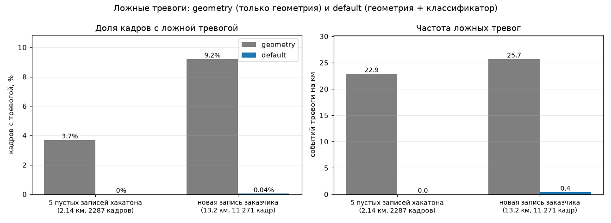
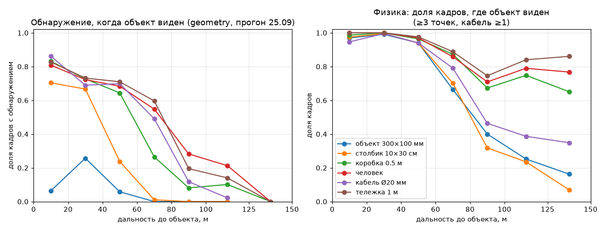
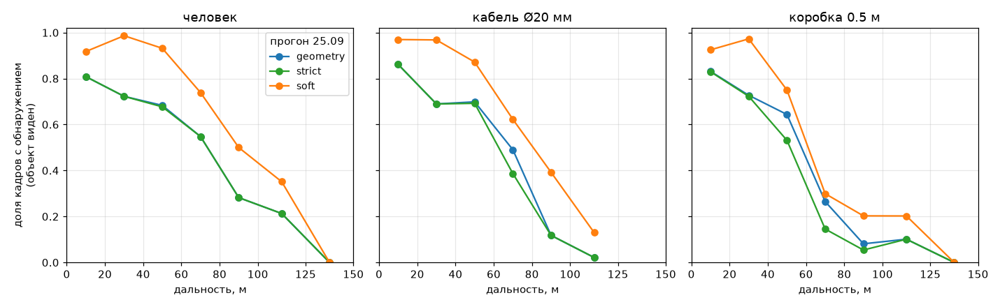
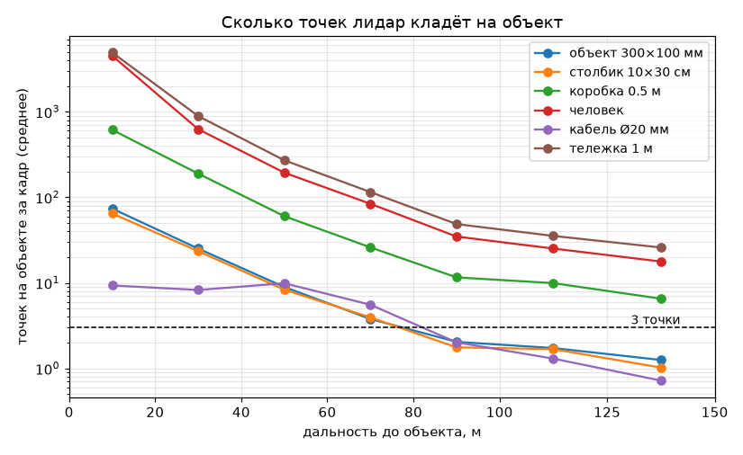
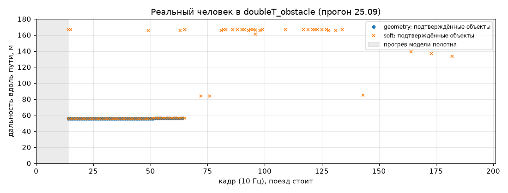
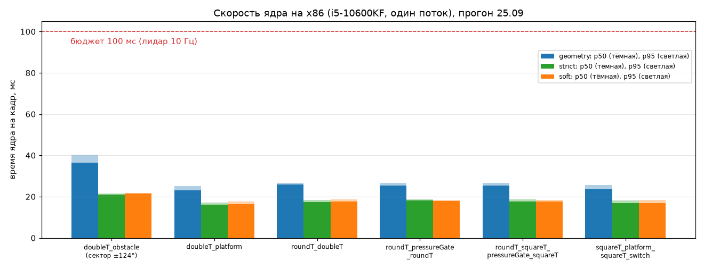
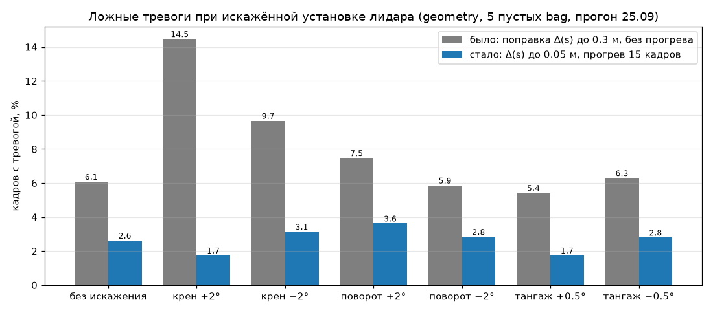
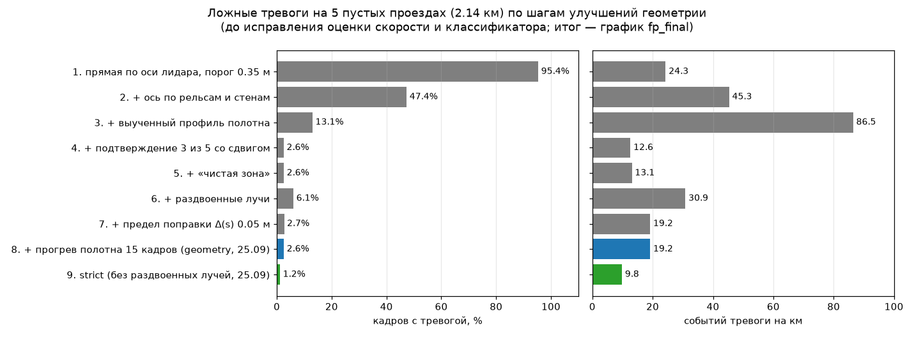

# Эксперименты

Документ отвечает на вопросы раздела 5 ТЗ: на какой дистанции обнаруживаются препятствия,
какова задержка обработки и частота, сколько ресурсов CPU/GPU занимает решение, какие были
ложные срабатывания, какие ситуации оказались сложными и как менялось качество по мере
улучшения алгоритма. Отдельно разобраны подходы, которые не сработали.

Режимы ядра (подробно — [ALGORITHM.md](ALGORITHM.md#режимы)):

- **`default`** — основной: геометрия с пониженными порогами + проверяющий классификатор
  LightGBM + подтверждение 3 из 5 кадров;
- **`geometry`** — прежний основной режим, только геометрия (до 27.09 он назывался
  `default`); в него же откатывается `default`, если классификатор недоступен;
- `strict`, `soft` — варианты геометрии: без раздвоенных лучей и с подтверждением 2 из 5.

Все цифры получены на сдаваемом коде: стенд `bench/` вызывает то же ядро
`metro_obstacle_core`, что и ROS-нода (`bench/core_adapter.py`, `bench.round4.make`). Цифры
истории улучшений и отвергнутых вариантов кругов 1–3 — на прототипах стенда
(`bench/detect.py`); ядро повторяет прототип покадрово при параметрах `BENCH_COMPAT`
(сверка `tests/parity.py`, режимы `geometry`, `strict`, `soft`).

Прогонов два поколения:

- **финальный (28.09)** — `default` против `geometry` на всех данных, включая данные
  заказчика; разделы [Итоговые результаты](#итоговые-результаты);
- **прогон 25.09** — режимы геометрии `geometry` / `strict` / `soft` с подробными таблицами
  по дальности, причинам ложных тревог, устойчивости к установке лидара. Он сделан до
  исправления оценки скорости (см. [историю](#история-улучшений)); в файлах результатов
  и на графиках этого прогона режим `geometry` записан под старым именем `default`, в
  документе он везде назван `geometry`. Разделы [Прогон 25.09](#прогон-2509-режимы-геометрии).

## Коротко

| вопрос ТЗ | ответ (режим `default`; в скобках — `geometry`) | подробно |
|---|---|---|
| дистанция обнаружения | наша синтетика, устойчиво (3 кадра подряд, медиана): человек 67 м, тележка 67 м, коробка 0.5 м 61 м (64), кабель Ø20 мм 55 м (66), столбик 10×30 см 33 м (43), объект 300×100 мм 17 м (32). Синтетика заказчика (первое подтверждение): куб 2×2 м — с 96.5 м, 0.3×0.3 м по центру — с 35.7 м, на рельсе — с 23.1 м, 2×0.2 м на рельсах — с 50.4 м. Реальный человек — на ~56 м, с первого кадра после прогрева | [обнаружение](#обнаружение-на-нашей-синтетике), [синтетика заказчика](#синтетика-заказчика) |
| задержка обработки | полное время кадра в ноде, Docker на x86 (i5-10600KF): p50 35.6 мс, p95 60.4 мс на облаке 921 600 точек; p50 35.5 / p95 43.8 мс на 307 тыс. точек. Ядро: p50 23.8 / p95 47.0 мс (x86, в ноде), p50 10.7 мс (ноутбук, один процесс). Классификатор — около 0.1 мс на кадр. Подтверждение 3 из 5 добавляет не меньше 2 кадров (0.2 с) от первого кадра с кандидатом | [скорость](#скорость-и-ресурсы) |
| кадров в секунду | выход на каждый кадр лидара — 10 Гц; худший p95 полного времени — 60% бюджета кадра 100 мс | [скорость](#скорость-и-ресурсы) |
| CPU / GPU | контейнер (нода + `ros2 bag play`) — около 2 ядер CPU на облаке 921 600 точек, около 0.5 ядра на 307 тыс.; память около 0.7 ГБ. GPU не используется | [скорость](#скорость-и-ресурсы) |
| ложные срабатывания | 5 пустых записей хакатона (2.14 км): 0.0% кадров, 0 событий на км (3.7% / 22.9). Новая реальная запись заказчика (13.2 км, в обучении не участвовала): 0.04% кадров, 0.4 события на км (9.2% / 25.7) | [ложные тревоги](#ложные-тревоги-default-и-geometry) |
| сложные ситуации | верх габарита вдали (потолочные конструкции на 50–130 м), старт записи в неудачном месте, объекты у кромки габарита, платформы и стрелки, переход круглый → сдвоенный тоннель, повороты (коридор кончается на 114–128 м) | [сложные ситуации](#сложные-ситуации) |
| как менялось качество | ложные тревоги 95.4% кадров (наивный вариант) → 13.1% (ось + профиль полотна) → 2.6% (подтверждение по кадрам) → 6.1% (раздвоенные лучи) → 2.6% (ограничение Δ(s)) → исправлена оценка скорости → классификатор: 0 событий на км на своих записях, 0.4 на новой записи → уточнение плоскости полотна с гистерезисом | [история улучшений](#история-улучшений) |
| длительная работа | 20-минутный непрерывный прогон ноды — [ниже](#длительная-работа) | [длительная работа](#длительная-работа) |

## Методика

Сырые логи прогонов (`out/`) в репозиторий не входят из-за объёма; в документе приведены
сводки, воспроизведение — раздел [Воспроизведение](#воспроизведение).

### Данные

**Записи хакатона.** Шесть записей, лидар Hesai Pandar128, 10 Гц, два отражения на луч
(dual return). Путь поезда — по траектории стенда (`bench/traj.py`: продольный шаг — по
сдвигу профиля интенсивности стен, поворот — из KISS-ICP); число кадров и километров
печатает `bench.make_figures`.

| bag | кадров | путь, км | сцена | точек в сообщении / валидных в кадре |
|---|---|---|---|---|
| `doubleT_obstacle` | 201 | поезд стоит | сдвоенный тоннель, человек на пути | 921 600 / ~346 тыс. |
| `doubleT_platform` | 345 | 0.213 | сдвоенный тоннель, платформа | 307 200 / ~165 тыс. |
| `roundT_doubleT` | 252 | 0.427 | круглый → сдвоенный тоннель | 307 200 / ~190 тыс. |
| `roundT_pressureGate_roundT` | 268 | 0.400 | круглый, гермозатвор | 307 200 / ~190 тыс. |
| `roundT_squareT_pressureGate_squareT` | 545 | 0.696 | круглый → прямоугольный, гермозатвор | 307 200 / ~190 тыс. |
| `squareT_platform_squareT_switch` | 877 | 0.403 | прямоугольный, платформа, стрелка | 307 200 / ~161 тыс. |

«Точек в сообщении» — размер `PointCloud2` (вместе с пустыми точками); «валидных» — медиана
по кадрам после отбрасывания невалидных и кропа стенда (вперёд до 230 м, вбок ±12 м).

Пять проездов без препятствий (2287 кадров, 2.14 км) служат для оценки ложных тревог:
любой подтверждённый объект на них считается ложным. Реальное препятствие одно — человек в
`doubleT_obstacle`.

**Данные заказчика** (получены после основной разработки, в обучении классификатора и в
подборе порогов не участвовали):

- **новая реальная запись** — около 20 минут движения, 11 271 кадр, 13.2 км, около 220
  файлов `.db3`; объектов в габарите нет, любая тревога — ложная. Прогон — отрезками: запись
  режется на 12 частей, каждая обрабатывается как новый старт ноды (12 разных точек старта
  с калибровкой заново) — так проверяется и устойчивость к месту старта;
- **синтетика заказчика** `cloud_with_fake_obj` — 1510 кадров, 10 объектов через ~100 м
  пути. Облако — 16 байт на точку, без полей `ring` и `timestamp`: кольца восстанавливаются
  по углу места, как в ноде (`cloud.py`).

### Наша синтетика

Генератор (`bench/synth.py`) вставляет объекты в реальные кадры пустых проездов
трассировкой лучей по сетке лидара:

- **Сетка лучей** — из данных: углы места 128 колец и шаг азимута каждого кольца (0.1° у
  центральных, 0.2° у крайних) берутся из первого кадра bag.
- **Пятно луча** 0.1° (0.2°) × 0.12° сэмплируется 5 × 5 подлучами. Доля пятна на объекте
  f ≥ 0.8 — оба отражения от объекта; 0.2 ≤ f < 0.8 — первое отражение от объекта, второе
  остаётся от фона (частичное попадание: кабель перед стеной); f < 0.2 — луч объекта не
  видит. Если исходная точка луча ближе объекта, объект этим лучом закрыт.
- **Положение.** Объект неподвижен в мире: стоит на эталонной оси пути (будущая траектория
  вблизи, стены вдали) на заданном расстоянии от начала проезда, поэтому при движении
  поезда честно приближается. Низ объекта — на уровне головок рельсов по точкам кадра
  (кабель свисает от 3.0 до 2.0 м над головками). Если эталонная ось до объекта не
  дотягивается, объект в кадр не ставится, и кадр в метрики этого объекта не входит.
- **Проезды.** Позиции через каждые 150 м пути в пяти пустых bag — 11 позиций; поперёк —
  на оси пути (6 позиций) или 0.6 м влево (5 позиций). 11 позиций × 6 типов = 66 проездов.
- **Наивная вставка** (контрольный вариант финального прогона): точки объекта добавляются в
  кадр, а фон за объектом не удаляется. Так вставляют объекты простые генераторы; проверка
  показывает, насколько результат зависит от способа вставки. Человек, коробка 0.5 м,
  столбик — ещё 33 проезда.

| объект | размер (вдоль × поперёк × высота), м | что проверяет |
|---|---|---|
| объект 300×100 мм | 0.30 × 0.30 × 0.10 | минимальный объект ТЗ |
| столбик 10×30 см | 0.10 × 0.10 × 0.30 | узкий низкий предмет |
| коробка 0.5 м | 0.5 × 0.5 × 0.5 | средний предмет |
| человек | 0.3 × 0.5 × 1.7 | крупный объект |
| кабель Ø20 мм | 0.02 × 0.02 × 1.0, висит | тонкий объект в верху габарита |
| тележка 1 м | 1.0 × 1.2 × 1.0 | крупный низкий объект |

**Допущения генератора** (синтетика заказчика от них отличается — поэтому она проверена
отдельно):

- объекты — параллелепипеды (человек тоже), интенсивность постоянная, шума дальности нет;
- размер пятна луча и порог 20% — наша модель, не паспорт лидара;
- поведение второго отражения при частичном попадании — предположение; отдельно проверено,
  что будет без него ([ниже](#без-второго-отражения));
- число точек на объекте считается с обоими отражениями: полное попадание луча даёт 2
  точки (так же их видит детектор).

### Честная оценка классификатора

Классификатор обучается на кандидатах геометрии, поэтому его нельзя проверять на тех же
записях. Схема финального прогона (`bench/verifier_e2e.py`):

- **ложные тревоги на 5 пустых записях** — для каждой записи отдельная модель, обученная
  без неё (на кандидатах четырёх других пустых записей и синтетике на них); порог —
  максимум оценки модели на отрицательных примерах её обучающих пустых записей;
- **обнаружение на нашей синтетике** — те же модели «без записи»: объект, вставленный в
  запись X, проверяется моделью, не видевшей X. Классификатор обучен на случайных формах, а
  не на именованных объектах таблицы выше — человек, коробка, кабель как таковые в обучении
  не встречаются;
- **данные заказчика** (новая запись, синтетика) — модель из пакета (обучена на всех пяти
  пустых записях); сами данные заказчика в обучении не участвовали.

### Метрики

- **Ложные тревоги** — на пустых записях: доля кадров, где есть хотя бы один
  подтверждённый объект; **событие** — серия подряд идущих кадров с тревогой; **события на
  км** — число событий на пройденный путь. Доля кадров говорит, как долго система
  тревожит зря, события на км — как часто.
- **Pd при видимом объекте** — доля кадров с обнаружением среди кадров, где на объект
  попало ≥ 3 точек (кабель — ≥ 1), по бинам дальности 20 м (дальше 100 м — 25 м).
  Обнаружение — подтверждённый объект ближе 2.5 м по дальности к ближней точке вставленного
  объекта. Разделение на «видим» и «обнаружен» отделяет предел сенсора от предела
  алгоритма.
- **Дальность устойчивого обнаружения** — дальность, на которой объект при подъезде впервые
  обнаружен 3 кадра подряд; проезд без такого обнаружения даёт 0; медиана по проездам.
- **Синтетика заказчика** — детекции группируются в места по мировой координате
  (пройденный путь по оценке ядра + дальность) и сопоставляются с 10 объектами; дальность —
  первое подтверждение при подъезде.
- **Время** — полное время кадра в ноде (`processing_ms` в `results_*.jsonl`: разбор облака +
  ядро) и время ядра (`core_ms`); отдельно — `Detector.process` на кадрах из кэша, один
  поток (`python -m tests.speed`), первый кадр каждого bag (калибровка) не входит.

## Итоговые результаты

### Ложные тревоги: default и geometry



| данные | `default`: кадров с тревогой / событий на км | `geometry` |
|---|---|---|
| 5 пустых записей хакатона (2.14 км, 2287 кадров), модель без проверяемой записи | **0.0% / 0** | 3.7% / 22.9 |
| новая реальная запись заказчика (13.2 км, 11 271 кадр, 12 точек старта) | **0.04% / 0.4** (5 событий) | 9.2% / 25.7 (339 событий) |

Источники: `out/pc_final/logs/v9/e2e.log` (в логе `base` = `geometry`,
`low+ver(случайные формы)` = `default`), `out/pc_final/logs/v9/newdata_geometry.log`
(строки `== geometry`, `== core_default`).

**Что осталось у `default` на новой записи.** 5 событий по одному кадру на 65–78 м: три —
низкие (0.31–0.36 м над опорой, ширина 0.9–1.1 м, 15–18 точек), два — на 1.18–1.35 м в
0.6–0.65 м от оси (42–43 точки). На своих записях после классификатора ложных нет.

**Что отсекает классификатор.** Почти все ложные `geometry` на новой записи — у верха
габарита (высота 2.4–2.8 м над опорой) на 50–130 м: потолочные конструкции тоннеля. Высота
вдали занижена в среднем примерно на 0.1 м (хвост — 0.3 м и больше): ошибка опоры и
тангажа растёт с дальностью, и нижний край конструкций оказывается под верхом габарита.
Геометрически такой кластер — компактный, изолированный и неподвижный, как настоящий
объект; отличает его сочетание признаков (высота у верха габарита, малая вертикальная
протяжённость, число точек для этой дальности), которое и выучивает классификатор.
Вторая группа ложных `geometry` — низкие кластеры из 2–5 точек у рельсов на 10–40 м
(раздвоенные лучи).

### Обнаружение на нашей синтетике

Устойчивое обнаружение (3 кадра подряд, медиана по 11 проездам), м:

| режим | 300×100 мм | столбик 10×30 | коробка 0.5 м | человек | кабель | тележка |
|---|---|---|---|---|---|---|
| `default` | 17 | 33 | 61 | **67** | 55 | **67** |
| `geometry` | 32 | 43 | 64 | 67 | 66 | 67 |
| `default`, наивная вставка | — | 28 | 50 | 66 | — | — |
| `geometry`, наивная вставка | — | 50 | 66 | 67 | — | — |

Трассировка лучей Pandar128 с пятном луча, объект на головках рельсов. Источник —
`out/pc_final/logs/v9/e2e.log`. Pd при видимом объекте, человек / коробка 0.5 м на
40–60 / 60–80 / 80–100 / 100–125 м: `default` — 0.83 / 0.64 / 0.32 / 0.11 и 0.82 / 0.32 /
0.08 / 0.03; `geometry` — 0.87 / 0.64 / 0.40 / 0.30 и 0.80 / 0.38 / 0.22 / 0.18.

- **Крупные объекты** (человек, тележка) — без потерь: 67 м в обоих режимах.
- **Мелкие и тонкие объекты** `default` находит ближе, чем `geometry`: классификатор
  срезает часть их кандидатов вдали (у мелочи на 40+ м 2–10 точек, по признакам она
  близка к шуму). Это осознанный обмен: на реальных данных `geometry` тревожит в 9% кадров
  и 26 раз на км, `default` — 0.04% и 0.4 раза на км, при этом крупные объекты находятся
  на той же дальности. В `default` раздвоенные лучи не используются (`split` выключен),
  поэтому объект 300×100 мм находится только за счёт пониженных порогов кластера.
- **Наивная вставка** (фон за объектом остаётся) у `default` даёт меньшую дальность по
  средним объектам (коробка 50 м против 61), у `geometry` — большую: `geometry` ловит
  «лишние» точки перед фоном как раздвоенные лучи. Цифры по мелочи зависят от способа
  вставки на 5–20 м; поэтому основная синтетика — с трассировкой лучей, а итог проверен на
  синтетике заказчика.

Дальности `geometry` здесь выше, чем в прогоне 25.09 (объект 300×100 — 32 м против 19,
столбик — 43 против 38, коробка — 64 против 58): между прогонами исправлена оценка
скорости (см. [историю](#история-улучшений), шаг 9) и добавлено уточнение плоскости полотна.

### Синтетика заказчика

`cloud_with_fake_obj`: 1510 кадров, 10 объектов через ~100 м пути; облако 16 байт на точку,
без `ring` и `timestamp`. Дальность — первое подтверждение при подъезде, м:

| объект заказчика | `default` | `geometry` | как должно быть |
|---|---|---|---|
| куб 2×2 м по центру | 96.5 | 96.7 | тревога |
| 0.3×0.3 м по центру (висит на 1.25–1.5 м) | 35.7 | 49.2 | тревога |
| 0.3×0.3 м на рельсе | 23.1 | 35.6 | тревога |
| 0.3×0.3 м у края габарита | 14.6 | 10.8 | тревога |
| 0.3×0.3 м за габаритом | нет тревоги | нет тревоги | нет тревоги |
| 2×2 м у края, внутри габарита | **пропуск** | пропуск | тревога |
| 2×2 м за габаритом | нет тревоги | нет тревоги | нет тревоги |
| 2×2 м над габаритом | нет тревоги | **ложная, 28 кадров** | нет тревоги |
| 2×0.2 м на рельсах | 50.4 | 80.6 | тревога |
| тонкий стержень 0.05 м с потолка (низ на 2.64 м над головками) | не подтверждается | 11.8 | тревога |

Всего кадров с тревогой: `default` — 141 из 1510, все у объектов заказчика; `geometry` —
367, в том числе 1–12-кадровые тревоги в местах без объектов. Источник —
`out/pc_final/logs/v9/customer.log` (`out/pc_final/out/verifier/customer.json`).

- **2×2 м у края внутри габарита** заходит в габарит на 7–9 см — меньше точности оси
  вдали. Коридор сужен на запас `margin0 + margin_k·s` (5 см + 1 мм/м), и край объекта в
  него не попадает. Расширение коридора к краю (`margin0 = 0`) отвергнуто: на реальных
  данных ложных становится больше (2.0 события на км против 0.4), а в реальных тоннелях
  оборудование стоит в 0.93–1.04 м от оси — в пределах тех же сантиметров от края
  габарита 1.05 м.
- **2×2 м над габаритом.** Генератор заказчика ставит высоту объекта от плоскости под
  лидаром; впереди подъём пути, и куб в облаке оказывается ниже 3 м над полотном —
  `geometry` принимает его нижний край за объект у верха габарита. Классификатор этот
  случай отсекает.
- **Верх габарита.** `gauge_height` = 3.0 м над прослеженным полотном = 2.74 м над
  головками рельсов. Синтетика заказчика задаёт границу между 2.64 м (висящий стержень —
  препятствие) и 2.83 м (куб над габаритом — не препятствие); 2.74 м — между ними.
- **Тонкий стержень с потолка** в `default` не подтверждается: у верха габарита вдали
  классификатор срезает похожие на него потолочные конструкции (именно они давали почти
  все ложные `geometry` на новой записи). Вариант «классификатор только дальше 20 м»
  возвращает стержень на 12 м, но на реальной записи даёт 5.7 события на км против 2.1 (прогон отрезками с 6 точками
  старта при прежней калибровке по первому кадру, один из стартов неудачный; финальный
  `default` по всей записи с 12 стартами — 0.4) —
  [отвергнут](#что-не-сработало).

### Реальный человек

В `doubleT_obstacle` поезд стоит всю запись (201 кадр), человек находится в габарите на
~56 м и затем уходит за его край. В обоих режимах тревога подтверждается с первого кадра
после прогрева модели полотна (кадр 14, 55.5–55.6 м) и держится, пока человек в
проверяемой части габарита. Других тревог в записи нет.

В ноде в Docker (финальный образ, `default`): тревога в кадрах 14–61 подряд (48 кадров) на
55.6 м, других тревог нет (`out/pc_final/logs/v10/run/results_doubleT_obstacle_*.jsonl`;
нода обработала 197 кадров из 201: прогон на x86 с глубиной очереди 1; 51 кадр с тревогой
ниже, в [длительной работе](#длительная-работа), — отдельный прогон на arm64 с глубиной 5). Подробный разбор прогона 25.09 (`geometry`, кадры 14–64,
снятие тревоги по выходу за полуширину габарита) — [ниже](#реальный-человек-прогон-2509).

### Устойчивость к месту старта

Нода калибруется по первому кадру: плоскость полотна задаёт высоту и наклон лидара. Если
запись начинается в неудачном месте (стрелка, уклон, поезд на соседнем пути), плоскость
первого кадра наклонена. На новой записи старт с файла 148 давал наклон плоскости 4.4°,
и при прежней калибровке это портило высоты до конца записи.

Проверка — `bench/starts.py`: запись запускается с разных файлов (111, 130, 145, 148), и
считаются тревоги на общем участке 148–157.

| калибровка | тревог на участке 148–157, старт 111 / 130 / 145 / 148 |
|---|---|
| по первому кадру (прежняя, `plane_every = 0`) | 0 / 0 / 0 / **10** |
| по первому кадру + уточнение на ходу с гистерезисом (итоговая) | 0 / 0 / 0 / **0** |

Режим `default`; источник — `out/pc_final/out/calib_stress/starts.log` (прежняя
калибровка — вариант `core_default_plane0`), `out/pc_final/logs/v9/starts.log`. У `geometry`
на том же участке при любой калибровке 7–25 ложных кадров — это его обычный уровень на
новой записи.

Уточнение на ходу: после первого кадра плоскость оценивается ещё на 20 кадрах подряд,
дальше на каждом 5-м; медиана последних 200 оценок заменяет плоскость первого кадра, только
если отличается от неё больше чем на 1° или 5 см ([ALGORITHM](ALGORITHM.md#шаг-2-автокалибровка)).
Вариант без гистерезиса (плоскость — всегда медиана) исправлял неудачный старт, но на
коротких записях давал лишние ложные тревоги (0.5 события на км): медиана из немногих
оценок шумит сильнее, чем удачная плоскость первого кадра. С гистерезисом удачный старт
ведёт себя как калибровка по первому кадру, неудачный — исправляется. На всей новой
записи (12 стартов) итоговая калибровка даёт те же 0.04% кадров и 0.4 события на км, что
и калибровка по первому кадру.

### Скорость и ресурсы

**Нода в Docker на x86.** Финальный образ, ПК Intel i5-10600KF (6 ядер / 12 потоков), Docker
в WSL; `ros2 launch ... bag:=` — нода и `ros2 bag play` в одном контейнере, 10 Гц, режим
`default`. Время — из `results_*.jsonl` (`processing_ms` — полное время кадра в ноде,
`core_ms` — ядро), CPU и память — `docker stats` раз в секунду.

| запись | точек в сообщении | кадров | полное время p50 / p95, мс | ядро p50 / p95, мс | CPU контейнера | память |
|---|---|---|---|---|---|---|
| `doubleT_obstacle` | 921 600 | 197 | 35.6 / 60.4 | 23.8 / 47.0 | ~2 ядра | ~0.7 ГБ |
| `cloud_with_fake_obj` (синтетика заказчика) | 307 тыс. | 1509 | 35.5 / 43.8 | — | ~0.5 ядра | ~0.7 ГБ |

CPU контейнера включает проигрывание bag (чтение sqlite и публикация облаков по ~9 МБ).
Источник — `out/pc_final/logs/v10/` (`stats_*.log`, `run/results_*.jsonl`, `build.log`).

- **Бюджет — 100 мс на кадр** (лидар 10 Гц). Худший p95 полного времени — 60.4 мс, поэтому
  выход идёт на каждый кадр лидара, 10 Гц. Подписка — очередь KEEP_LAST глубины 5
  (`input_depth`): в норме пуста, а пачки кадров от источника разбирает без потерь; при
  `input_depth=1` обрабатывается всегда только самый свежий кадр.
- **Ядро однопоточное**: горячие циклы — numba в один поток, классификатор — LightGBM в
  один поток. Остальные ядра процессора остаются системе.
- **Классификатор** — около 0.1 мс на кадр: кандидатов после геометрии единицы–десятки.
- **Уточнение плоскости полотна** — одна оценка RANSAC 8–13 мс (p50 на стенде,
  `starts.log`); после первых 20 кадров оценка идёт на каждом 5-м кадре — в среднем около
  2 мс на кадр. Отсюда и часть хвоста p95.
- **GPU не используется**; ноде нужен только CPU.
- **Образ** x86 — 1.24 ГБ, сборка около 1.5 мин (с кэшем базового образа);
  numba-ядра прогреваются при сборке, старт ноды до `detector ready` — 0.3 с.
- **Ядро на ноутбуке разработчика**, один процесс, 921 600 точек в кадре: `default`
  p50 10.7 мс.
- Проверочный стенд ТЗ — i7-9700E; на нём не мерили. По паспорту его частота ниже
  (2.6 / 4.4 ГГц против 4.1 / 4.8 ГГц), однопоточно он медленнее, но запаса по p95 (1.7×
  на самом тяжёлом облаке) на это должно хватить.

Однопоточный замер ядра по всем записям хакатона (прогон 25.09, `geometry`) —
[ниже](#скорость-ядра-по-записям-прогон-2509).

### Длительная работа

20-минутный непрерывный прогон ноды в Docker на x86 (i5-10600KF, WSL 2 с 16 ГБ памяти;
финальный образ, `default`; `ros2 launch … bag:=new_data`: нода и `ros2 bag play` в одном
контейнере). Источник — `out/pc_final/logs/v11/`.

| показатель | значение |
|---|---|
| запись, длительность | новая запись заказчика, 1200 с (11 271 кадр, 221 файл .db3, ~90 ГБ) |
| принято и обработано нодой | 10 540 кадров, сбойных 0; нода завершилась штатно (`finished cleanly`) |
| полное время кадра p50 / p95 / p99 / max, мс | 21.8 / 29.7 / 31.2 / 48.0 (ядро p50 18.4 / p95 26.2) |
| CPU контейнера (нода + bag play), медиана / p95 / пик | 35% / 62% / 168% одного ядра |
| память | нода ~0.26 ГБ, стабильно; память контейнера растёт до ~7 ГБ за счёт `ros2 bag play` (RSS плеера 7.9 ГБ) |
| кадров с тревогой, событий на км | 8 кадров (0.08%), 8 событий = 0.6 на км |

Время кадра за 20 минут не растёт, утечек в ноде нет. Найденная проблема — потери кадров
на доставке: 731 кадр (6.5%) не дошёл до ноды, все — в последней четверти прогона.
Разбор (`out/pc_final/logs/v12/`): при старте проигрывания с 13-й минуты
(`--start-offset 780`) потери начинаются сразу, а RSS `ros2 bag play` — 7.9 ГБ при 16 ГБ
памяти WSL; нода при этом обрабатывает кадр за те же 22 мс. То есть плеер под нехваткой
памяти отдаёт кадры пачками, а подписка с очередью глубины 1 оставляла из пачки только
последний. Исправление — очередь глубины 5 (`input_depth`, по умолчанию 5): кадр
обрабатывается в 3–5 раз быстрее периода лидара, поэтому в норме очередь пуста и задержку
не добавляет, а пачку разбирает без потерь. Проверено на `doubleT_obstacle` в Docker
(arm64): принято 201 кадр из 201, тревог 51 — как на стенде. Это отдельный прогон: на x86
с глубиной 1 нода получила 197 кадров из 201, тревога — в 48 из них (см.
[реального человека](#реальный-человек)). Повторить 20-минутный прогон на x86 с новой глубиной не успели. На стенде
проверки (128 ГБ памяти) нехватки памяти у плеера ожидать не стоит.

## Прогон 25.09: режимы геометрии

Разделы ниже — прогон ядра 25.09 (`out/eval_final_pc/`, `out/round4_pc/`) для режимов
геометрии. `geometry` здесь — прежний основной режим (в файлах результатов записан как
`default`), до исправления оценки скорости. Относительные выводы (физический предел,
причины ложных тревог, устойчивость к установке) к финальному коду применимы; абсолютные
цифры `geometry` в финальном прогоне другие — см. [выше](#итоговые-результаты).

### Ложные тревоги по режимам геометрии

| режим | кадров с тревогой | событий | событий на км | тревог ближе 100 м, % кадров | длина коридора, медиана |
|---|---|---|---|---|---|
| `geometry` | 2.6% | 41 | 19.2 | 1.7% | 122 м |
| `strict` | 1.2% | 21 | 9.8 | 0.7% | 122 м |
| `soft` | 7.4% | 87 | 40.7 | 4.3% | 122 м |

5 пустых проездов, 2287 кадров, 2.14 км. Источник — `out/eval_final_pc/` (сводка
`out_fin_empty.log`). Разбор по bag и причинам — [ниже](#ложные-тревоги-по-bag-и-по-причинам).

### Обнаружение по дальности



Слева — доля кадров с обнаружением, когда объект виден (`geometry`, прогон 25.09); справа —
доля кадров, где объект вообще виден лидару. Точка на графике — если в бине не меньше 20
кадров.

Pd при видимом объекте, `geometry`:

| объект | 0–20 | 20–40 | 40–60 | 60–80 | 80–100 | 100–125 | 125–150 |
|---|---|---|---|---|---|---|---|
| объект 300×100 мм | 0.06 | 0.26 | 0.06 | 0.00 | 0.00 | 0.00 | 0.00 |
| столбик 10×30 см | 0.70 | 0.67 | 0.24 | 0.01 | 0.00 | 0.00 | — |
| коробка 0.5 м | 0.83 | 0.73 | 0.64 | 0.26 | 0.08 | 0.10 | 0.00 |
| человек | 0.81 | 0.72 | 0.68 | 0.55 | 0.28 | 0.21 | 0.00 |
| кабель Ø20 мм | 0.86 | 0.69 | 0.70 | 0.49 | 0.12 | 0.02 | 0.00 |
| тележка 1 м | 0.83 | 0.73 | 0.71 | 0.60 | 0.20 | 0.14 | 0.00 |

«—» — меньше 20 видимых кадров (у столбика на 125–150 м их 3).

Бин 0–20 м включает мёртвую зону 0–5 м перед лидаром и стоянки поезда рядом с объектом
(у человека 595 видимых кадров на 0–20 м против 220 на 20–40 м), поэтому Pd там не 1.

**Дальность устойчивого обнаружения** (3 кадра подряд, медиана по 11 проездам), м:

| режим | 300×100 мм | столбик 10×30 | коробка 0.5 м | человек | кабель | тележка |
|---|---|---|---|---|---|---|
| `geometry` | 19 | 38 | 58 | 67 | 66 | 67 |
| `strict` | 0 | 28 | 50 | 67 | 50 | 67 |
| `soft` | 0 | 35 | 60 | 68 | 67 | 71 |

Режимы на крупных объектах и кабеле:



- `geometry` и `strict` различаются только раздвоенными лучами: на человеке и тележке
  совпадают, на кабеле (60–80 м: 0.49 против 0.39), коробке 0.5 м (40–60 м: 0.64 против 0.53)
  и мелочи `geometry` лучше. Объект 300×100 мм без раздвоенных лучей геометрия не находит
  (`strict`: 0.01 на 0–20 м).
- `soft` (2 из 5 кадров, запас по ширине 0.002 м/м) заметно выше на средних дальностях:
  человек на 60–80 м — 0.74 против 0.55, кабель на 80–100 м — 0.39 против 0.12 — ценой
  в 2.9 раза большего числа ложных тревог (7.4% кадров).

Источник — `out/eval_final_pc/synth__core.json`; в `out_fin_synth.log` Pd посчитан по
всем кадрам со вставкой, без условия видимости (человек на 60–80 м: 0.47).

### Физический предел: сколько точек попадает на объект



Среднее число точек на объекте за кадр (с обоими отражениями) и доля кадров, где объект
виден (≥ 3 точек, кабель ≥ 1). От режима детектора не зависит:

| объект | 0–20 | 20–40 | 40–60 | 60–80 | 80–100 | 100–125 | 125–150 |
|---|---|---|---|---|---|---|---|
| объект 300×100 мм | 74 / 0.97 | 25 / 0.99 | 9 / 0.94 | 3.8 / 0.66 | 2.0 / 0.40 | 1.7 / 0.25 | 1.3 / 0.16 |
| столбик 10×30 см | 65 / 0.97 | 24 / 1.00 | 8 / 0.94 | 3.9 / 0.70 | 1.8 / 0.32 | 1.7 / 0.24 | 1.0 / 0.07 |
| коробка 0.5 м | 616 / 0.99 | 189 / 1.00 | 60 / 0.96 | 26 / 0.87 | 12 / 0.67 | 10 / 0.75 | 6.5 / 0.65 |
| человек | 4524 / 1.00 | 625 / 1.00 | 194 / 0.97 | 84 / 0.86 | 35 / 0.71 | 25 / 0.79 | 18 / 0.77 |
| кабель Ø20 мм | 9 / 0.95 | 8 / 1.00 | 10 / 0.94 | 5.6 / 0.79 | 2.0 / 0.46 | 1.3 / 0.39 | 0.7 / 0.35 |
| тележка 1 м | 4929 / 1.00 | 890 / 1.00 | 271 / 0.98 | 115 / 0.89 | 49 / 0.75 | 35 / 0.84 | 26 / 0.86 |

Где предел сенсора, а где алгоритма — сопоставление с Pd выше:

- **Мелкие объекты (300×100, столбик) — дальше 80 м предел сенсора:** в среднем 2 точки и
  меньше, объект виден в 24–40% кадров. До 60 м они видны в 94–100% кадров, а Pd объекта
  300×100 не выше 0.26 — **здесь предел алгоритма.** Высота объекта 10 см над головкой
  рельса почти равна порогу высоты над нормой полотна $T(s) = 0.08 + 0.0015\,s$ м
  (0.11 м уже на 20 м), и геометрия находит его только раздвоенными лучами с фиксированным
  порогом 0.05 м.
- **Крупные объекты на 60–125 м — предел алгоритма и геометрии коридора:** человек и
  тележка видны в 71–89% кадров (десятки точек), а Pd 0.14–0.60. Проверяемая полуширина
  габарита `geometry` сужается с дальностью ($W = 0.68$ м на 80 м, 0.6 м на 100 м), и объект,
  смещённый на 0.6 м от оси, дальше 80 м не находится ни разу; на оси пути человек на
  80–100 м находится в 39% видимых кадров. В `default` коридор сужается вчетверо медленнее
  (0.001 м/м), лишние кандидаты у краёв отсекают отбраковка у края и классификатор.
- **Дальше 125 м — конец коридора:** крупные объекты видны в 65–86% кадров, Pd = 0.
  Медианная длина прослеженной оси — 122 м, у видимого человека на 125–150 м ось доходит до
  объекта лишь в 52% кадров; в поворотах круглого тоннеля прямая видимость около 130 м.
- **Кабель** даёт в среднем 8–10 точек до 60 м (частичные попадания пятна луча) и
  находится в 69–86% видимых кадров; дальше 80 м — 2 точки и меньше, предел сенсора.

Ранняя оценка точек на объекте (первый генератор: тонкий луч без пятна, объекты стояли в
одном сечении и частично закрывали друг друга) давала в 2–4 раза меньше: 6 точек на объекте
300×100 на 20–40 м против 25 здесь. Цифры этого раздела — на текущем генераторе, на нём же
посчитан Pd.

### Реальный человек (прогон 25.09)



Режим `geometry` (и `strict` — то же самое):

- тревога подтверждена с кадра 14 — первого кадра после прогрева модели полотна
  (15 обновлений, 1.5 с) — на дальности 55.5 м;
- держится кадры 14–64 (51 кадр) на 55.5–56.5 м; смещение от оси +0.45…+0.76 м, к концу
  растёт до +0.76 м;
- снимается с кадра 65: человек выходит за проверяемую полуширину ($W = 0.77$ м на 56 м);
- других тревог в записи нет.

Для сравнения: наивный вариант (прямая по оси лидара, порог 0.35 м) тревожит все 201 кадр;
прототип с прежними умолчаниями (`delta_clip` = 0.3, без прогрева) находил человека в
кадрах 13–64 и давал ещё 49 кадров ложных тревог на 20–25 м у правой кромки габарита
(смещение −0.9 м, 0.12 м над нормой) —
их убрало ограничение поправки Δ(s). Режим `soft` находит человека так же, но добавляет
отдельные тревоги на 84–167 м (82 кадра с тревогой всего), в том числе повторяющийся объект
на ~166 м, стоящий на месте всю запись; что это, по данным не установлено.

Источник — `out/eval_final_pc/empty__doubleT_obstacle__core:*.json` (`core:default` =
`geometry`), `out/eval/` (прототипы).

### Скорость ядра по записям (прогон 25.09)



Замер `python -m tests.speed --bags all --modes default,strict,soft` (тогдашний `default` =
`geometry`) на ПК с Intel i5-10600KF (x86_64), один поток, мс на кадр:

| bag | `geometry` p50 / p95 / max | `strict` p50 / p95 | `soft` p50 / p95 |
|---|---|---|---|
| `doubleT_obstacle` | 36.4 / 40.2 / 41.0 | 20.9 / 21.4 | 21.5 / 21.9 |
| `doubleT_platform` | 23.1 / 25.2 / 27.7 | 16.0 / 17.2 | 16.4 / 17.7 |
| `roundT_doubleT` | 25.8 / 26.6 / 39.2 | 17.5 / 18.3 | 17.7 / 18.6 |
| `roundT_pressureGate_roundT` | 25.5 / 26.6 / 35.4 | 18.1 / 18.7 | 17.8 / 18.4 |
| `roundT_squareT_pressureGate_squareT` | 25.5 / 26.7 / 30.0 | 17.7 / 18.8 | 17.6 / 18.5 |
| `squareT_platform_squareT_switch` | 23.7 / 25.7 / 36.9 | 16.8 / 18.1 | 17.0 / 18.5 |

Первый кадр каждого bag (калибровка, RANSAC) — 43–76 мс в `geometry`; загрузка ядер numba из
кэша — 0.34 с до первого кадра. Источник — `out/eval_final_pc/out_fin_speed.log`.

- **Раздвоенные лучи** стоят 7–16 мс на кадр (`geometry` против `strict`, p50): поиск пар
  отражений требует упорядочить всё облако по кольцу и азимуту. В `default` они выключены,
  поэтому его ядро по времени ближе к `soft`, плюс уточнение плоскости и классификатор.
- Время в таблицах стенда (`out_fin_empty.log`, p95 58 мс) выше потому, что там параллельно
  шли несколько прогонов; для скорости используется только отдельный однопоточный замер.

### Устойчивость к установке лидара

Установка лидара на поезде заказчика может отличаться от записей хакатона. Проверено
искажением всего кадра — как если бы тот же тоннель снимал иначе установленный лидар
(`bench/round4.py`; поворот применяется после вставки синтетики).



| искажение | было: `delta_clip` 0.3, без прогрева | стало: итоговые умолчания |
|---|---|---|
| — | 6.1% / 30.9 | 2.6% / 19.2 |
| крен +2° / −2° | 14.5% / 40.2; 9.7% / 40.2 | 1.7% / 14.0; 3.1% / 19.2 |
| поворот +2° / −2° | 7.5% / 32.7; 5.9% / 29.0 | 3.6% / 20.1; 2.8% / 17.8 |
| тангаж +0.5° / −0.5° | 5.4% / 28.5; 6.3% / 32.3 | 1.7% / 14.5; 2.8% / 20.1 |

Кадров с тревогой / событий на км, `geometry`, 5 пустых проездов. Источник —
`out/round4_pc/empty.json`. Режим `default` с искажениями установки отдельно не прогонялся;
его модель полотна (`delta_clip`, прогрев) та же, а на новой записи заказчика — другом
поезде и другой установке лидара — он проверен целиком.

- Чувствительность к крену была тем же механизмом, что и «низкие» ложные тревоги: при крене
  в полосу рельсов вдали попадает пол, поправка Δ(s) опускает опору. Ограничение
  Δ(s) до ±0.05 м её сняло: при крене ±2° ложных не больше, чем без искажения было раньше.
- Обнаружение при искажениях почти не меняется: человек при видимом объекте на 40–60 м —
  0.65–0.68 при всех искажениях против 0.68 без них; объект 300×100 на 20–40 м — 0.12–0.27
  против 0.26 (`out/round4_pc/report.md`).
- Высота установки ±0.3 м на ложные тревоги не влияла (6.0–6.1% кадров у тогдашнего
  основного режима); этот прогон сделан отдельно, сырые данные не сохранены.

### Без второго отражения

Раздвоенные лучи работают, только если в облаке оба отражения луча. Если лидар заказчика
или его синтетика отдают одно отражение, `geometry` ведёт себя как `strict`. `default`
раздвоенные лучи не использует и от второго отражения в этом смысле не зависит. Прогон
`geometry` на той же синтетике, где частичное попадание заменяет оба отражения точкой
объекта (`out/round4_pc/synth.json`, итоговые умолчания):

| объект | два отражения: Pd 0–20 / 20–40 / 40–60 м, устойчиво | одно отражение: Pd 0–20 / 20–40 / 40–60 м, устойчиво |
|---|---|---|
| объект 300×100 мм | 0.06 / 0.26 / 0.06, 19 м | 0.01 / 0.00 / 0.00, 0 м |
| столбик 10×30 см | 0.83 / 0.67 / 0.24, 38 м | 0.31 / 0.58 / 0.06, 28 м |
| коробка 0.5 м | 0.83 / 0.73 / 0.64, 57 м | 0.83 / 0.73 / 0.53, 50 м |
| человек | 0.81 / 0.72 / 0.68, 67 м | то же |
| кабель Ø20 мм | 0.86 / 0.69 / 0.70, 66 м | то же |

Без второго отражения объект 300×100 мм геометрия не находит совсем, столбик вблизи находит
реже (0–20 м: 0.83 → 0.31, устойчиво с 28 м вместо 38 м), коробку 0.5 м — немного реже.
Человек и кабель от второго отражения не зависят; тележка в этом прогоне не участвовала, но
у неё `geometry` и `strict` (без раздвоенных лучей) совпадают по всем бинам.

### Ложные тревоги по bag и по причинам

| bag | `geometry` | `strict` | `soft` | длина коридора, медиана |
|---|---|---|---|---|
| `doubleT_platform` | 7.0% / 84.4 | 4.1% / 51.6 | 12.2% / 89.1 | 128 м |
| `roundT_doubleT` | 7.5% / 28.1 | 2.4% / 9.4 | 22.2% / 44.5 | 119 м |
| `roundT_pressureGate_roundT` | 0.4% / 2.5 | 0.4% / 2.5 | 2.6% / 15.0 | 116 м |
| `roundT_squareT_pressureGate_squareT` | 0.0% / 0.0 | 0.0% / 0.0 | 4.8% / 27.3 | 114 м |
| `squareT_platform_squareT_switch` | 1.8% / 24.8 | 0.8% / 12.4 | 4.3% / 59.5 | 126 м |

Кадров с тревогой / событий на км. Одиночные тоннели почти чистые; тревоги сосредоточены на
платформах, стрелках и переходах типа тоннеля.

41 событие `geometry` разобрано по положению детекций (дальность $s$, высота над
нормой $h$, номер кадра; правила — `classify` в `bench/make_figures.py`):

| причина | событий `geometry` | кадров | событий `strict` | где |
|---|---|---|---|---|
| дальняя зона ≥ 85 м, объект выше 0.3 м | 22 | 31 | 18 | подъезд к платформам и стрелке (`doubleT_platform`, `squareT_platform_…`), концы коридора на 110–144 м |
| низко (< 0.3 м), 2–4 точки у рельса, ближе 40 м | 12 | 16 | 0 | `doubleT_platform` (34 м, смещение −0.57 м — у правого рельса, 6–7 см), `roundT_doubleT` (15–20 м, −0.9 м — у правой кромки габарита) |
| верх габарита, 60–85 м | 4 | 8 | 2 | `roundT_doubleT`, кадры 108–136: переход круглый → сдвоенный, свод на 1.8–2.7 м над нормой у кромки |
| низко (< 0.3 м), дальше 40 м | 2 | 3 | 0 | `squareT_platform_…`, 81–83 м у оси |
| первые кадры после прогрева | 1 | 2 | 1 | `doubleT_platform`, кадры 14–15: сразу после прогрева, 35–65 м, кластеры до 136 точек; причина не разобрана |

- **Дальняя зона** — главный источник: у платформ и стрелок стены перестают быть
  параллельны пути, ось вдали уходит на сантиметры–дециметры, и край платформы или
  конструкции стрелки попадает в сузившийся коридор. Эти тревоги короткие: 22 события —
  31 кадр, самое длинное — 4 кадра.
- **Низкие у рельса** — это раздвоенные лучи (2–4 точки, 6–7 см над нормой): в `strict` их
  нет. Цена детектора объекта 300×100 мм в `geometry` — 12 из 41 события.
- **Переход круглый → сдвоенный** — профиль полотна и ось учатся на ближней зоне, а
  сечение тоннеля меняется за десятки метров; верхние углы габарита задевают свод. В
  `soft` (запас по ширине вдвое меньше) этот bag даёт 22.2% кадров с тревогой.

Все три класса — компактные кластеры у краёв коридора или у верха габарита; именно их
в `default` отсекают отбраковка кластеров у края габарита и классификатор.

До ограничения Δ(s) картина была другой. Разбор тогдашнего основного режима по классам
положения детекций (131 событие-класс на 2.14 км): 48 — «центр пути, низко (< 0.3 м), ближе
60 м» (начало записей и переход круглый → сдвоенный), 50 — «центр пути, высоко, дальше 60 м»
(подъезд к платформам и стрелке). Корень «низких»: при смещении оси в полосу
рельсов вдали попадает пол (на ~0.25 м ниже головок), поправка Δ(s) опускает опору, и весь
участок пола выглядит выше нормы ([история](#история-улучшений), шаг 7).

## История улучшений



| шаг | что сделано | кадров с тревогой | событий на км | что дало |
|---|---|---|---|---|
| 1 | прямая по оси лидара, порог 0.35 м над плоскостью полотна | 95.4% | 24.3 | отправная точка: лидар повёрнут к пути (~1.7° в `doubleT_obstacle`), путь изгибается, полотно не плоское |
| 2 | ось пути: рельсы вблизи, стены вдали, RANSAC-кубика, обрыв на последнем согласованном бине | 47.4% | 45.3 | коридор идёт по пути, а не по лучу лидара |
| 3 | выученный поперечный профиль полотна, опора — уровень головок рельсов | 13.1% | 86.5 | порог в сантиметрах над нормой вместо 0.35 м над плоскостью; тревоги стали короткими, отсюда рост событий/км |
| 4 | подтверждение 3 из 5 кадров со сдвигом истории на пройденный путь | 2.6% | 12.6 | шум не держится на одном месте пути |
| 5 | «чистая зона»: в верху габарита достаточно 2 точек | 2.6% | 13.1 | кабель находится в 2–3 раза чаще без роста ложных |
| 6 | раздвоенные лучи (dual return) | 6.1% | 30.9 | единственное, что в геометрии находит объект 300×100 мм; ложных в 2.4 раза больше |
| 7 | предел поправки Δ(s) ±0.05 м (было ±0.3 м) | 2.7% | 19.2 | снял «низкие» ложные и чувствительность к крену |
| 8 | прогрев модели полотна 15 кадров — `geometry` прогона 25.09 | 2.6% | 19.2 | нет подтверждений, пока профиль полотна не выучен |
| — | `strict` = шаг 8 без раздвоенных лучей | 1.2% | 9.8 | минимум ложных для геометрии |
| 9 | исправлена оценка скорости: на движущемся поезде она залипала на нуле — `geometry` финального кода | 3.7% | 22.9 | подтверждение по кадрам снова учитывает пройденный путь; дальность по мелким объектам выросла: объект 300×100 — 19 → 32 м, столбик — 38 → 43 м, коробка 0.5 м — 58 → 64 м |
| 10 | геометрия с пониженными порогами + проверяющий классификатор LightGBM + 3 из 5 — `default` | **0.0%** | **0** | ложные на своих записях убраны полностью (модель без проверяемой записи); на новой записи заказчика — 0.04% кадров и 0.4 события на км против 9.2% и 25.7 у `geometry` |
| 11 | уточнение плоскости полотна на ходу с гистерезисом | 0.0% | 0 | устойчивость к месту старта: неудачный старт (наклон плоскости 4.4°) — 0 ложных кадров вместо 10 |

Источники: шаги 1–6 — `out/eval/` (прототипы), шаг 7 — `out/round4_pc/empty.json`, шаг 8 и
`strict` — `out/eval_final_pc/` (прогон ядра 25.09, совпадает с прогоном 4-го круга), шаги
9–10 — `out/pc_final/logs/v9/e2e.log`, `newdata_geometry.log`, шаг 11 —
`out/pc_final/out/calib_stress/starts.log`, `out/pc_final/logs/v9/starts.log`. График —
шаги 1–8 (до исправления оценки скорости и классификатора); итог — график
[fp_final.png](#ложные-тревоги-default-и-geometry).

**Шаг 9 — ошибка оценки скорости.** Прототип стенда штрафовал отличие сдвига за кадр от
прошлого сдвига жёстко (0.5 z на бин 5 см сверх 7.5 см) начиная с первого кадра, когда
прошлый сдвиг ещё 0: на движущемся поезде оценка «залипала» около нуля, и история
подтверждений не сдвигалась на пройденный путь. Исправление (`speed.py`): первые три кадра —
без штрафа (захват реальной скорости), дальше мягкий штраф 0.05 z на бин только за
изменение больше 0.3 м за кадр. Поведение прототипа оставлено параметром `speed_legacy` —
только для сверки со стендом. После исправления дальность по мелким объектам выросла
(таблица выше), по крупным не изменилась (67 м); ложных у `geometry` стало немного больше (2.6% →
3.7% кадров, 19.2 → 22.9 события на км) — вероятно, подтверждаться стали и ложные
кандидаты, которые раньше не набирали голосов. В цифры шага 9 входит и уточнение
плоскости полотна (шаг 11 для `geometry` включён так же).

Что стоили шаги обнаружению:

- **Шаг 5** (кабель при видимом объекте, генератор второго круга): 0–20 / 20–40 / 40–60 м —
  0.18 / 0.06 / 0.09 → 0.55 / 0.27 / 0.18.
- **Шаг 6** (объект 300×100 при видимом объекте, генератор с пятном луча): 0.08 / 0 / 0 →
  0.66 / 0.28 / 0.10 на 0–20 / 20–40 / 40–60 м.
- **Шаг 7** снял и часть обнаружений: объект 300×100 на 0–20 м — 0.66 → 0.06 (на 20–40 м
  без изменений: 0.28 → 0.26), устойчивое обнаружение — 25 → 19 м; коробка 0.5 м на 60–80 м —
  0.34 → 0.26, устойчиво 66 → 57 м. Человек, кабель, тележка не изменились (67 / 66 м).
  Вероятная причина: те же отрицательные поправки Δ(s), что давали ложные «низкие» тревоги,
  «поднимали» и низкий объект над порогом. Мы сочли это приемлемой ценой: ложных тревог
  меньше в 2.3 раза. Вариант `delta_clip` = 0 даёт ещё меньше ложных (2.4%, 14.0 на км),
  но теряет мелочь: объект 300×100 на 20–40 м — 0.08 против 0.26, столбик 10×30 на 0–20 м —
  0.65 против 0.83 (без второго отражения — 0.08 против 0.31); не взят.
- **Шаг 8** — малый эффект (2.7 → 2.6% кадров, события те же), но убирает класс тревог
  на первых кадрах проезда; цена — 1.5 с без подтверждений после старта (реальный человек
  подтверждён на кадре 14 вместо 13).
- **Шаг 10** — крупные объекты без потерь (человек, тележка — 67 м), мелкие и тонкие
  находятся ближе, чем в `geometry`: объект 300×100 — 17 м против 32, столбик — 33 против 43,
  кабель — 55 против 66, коробка 0.5 м — 61 против 64 ([таблица](#обнаружение-на-нашей-синтетике)).
  На синтетике заказчика — то же: куб 2×2 м на той же дальности (96.5 против 96.7 м), мелочь
  ближе ([таблица](#синтетика-заказчика)). Обмен принят: ложных на реальных данных в 60 раз
  меньше по событиям на км.
- **Шаг 11** на обнаружение не влияет: на удачном старте плоскость остаётся плоскостью
  первого кадра.

## Что не сработало

Все варианты — на том же стенде: пустые проезды для ложных тревог, та же синтетика; варианты
последних кругов — ещё и на данных заказчика. Сравнение — с вариантом того же круга без
изменения. Хороший разбор неудачи экономит время следующему, поэтому указано и «почему».

| вариант | результат | почему не взяли |
|---|---|---|
| **Одометрия по облакам (KISS-ICP)** | в круглом тоннеле `roundT_pressureGate_roundT` около 2 км/ч при реальных ~54 км/ч; поворот накапливает ошибку, ось из траектории уходит на 2–5 м к 60–90 м в поворотах | однородный тоннель вдоль оси не имеет геометрических признаков — ICP вырождается. Заменена сдвигом профиля **интенсивности** стен (p90 54.7 км/ч в том же bag; `out/odom/compare.png`). Профиль по густоте точек «залипает» на нуле: рисунок колец едет вместе с лидаром |
| **Ось только по рельсам** (B+D) | 11.8% кадров, 42.5 события/км, но длина оси — 54 м в медиане против 122–124 м | дальше 30 м рельсы по 1–2 точкам на головку не находятся; дальность важнее |
| **Ось из траектории** («эталон», Oracle+D+C) | 19.4% кадров, 19.6 на км против 2.6% у оси из данных | траектория не видит поворота лидара к пути (~1.7°) |
| **Фильтр Калмана по оси** (рельсы + стены, K+D+C) | 20.3% кадров, 25.2 на км, ось 106 м | на стрелках и переходах типа тоннеля фильтр держится за старую модель; не доводился |
| **Фон по лучу** (Z+B c3): помнить нормальную дальность каждого луча, искать укорочение | 24.6% кадров, 56.1 на км против 2.6% / 13.1 | «нормальная» дальность меняется на переходах и в поворотах |
| **Сетка уверенности** (E, E5): копить свидетельства по ячейкам пути | 25.2% / 11.8% кадров, 84.6 / 14.5 на км; человек на 40–60 м — Pd 0.03 | дальше 40 м обнаружение падает почти до нуля; не отлаживалась |
| **Накопление точек за 3 кадра** (ZA c3), для дальности > 60 м | 9.7% кадров, 29.9 на км против 2.6% / 13.1; человек на 60–80 м — Pd 0.03 против 0.58 | совмещение кадров по оценке пройденного пути недостаточно точное — объект «размазывается» |
| **Продление оси на 30 м** (ZE c3) | ось 152 м против 124; человек на 60–80 / 80–100 м — 0.61 / 0.31 против 0.58 / 0.31; ложных 3.8% и 21.0 на км против 2.6% и 13.1 | на 100–150 м упираемся в сузившийся коридор и растущий порог высоты — дальности не прибавилось |
| **Скачки глубины** (range image, `bench/depth_layer.py`): независимое подтверждение дальних кандидатов | на пустом тоннеле 7–10 кандидатов на кадр выше головок рельсов; дальше ~100 м не видит — маске коридора нужна та же ось, а она в поворотах кончается на 102–104 м | шумит, а в дальней зоне упирается в ту же ось; узкое место дальней зоны — длина надёжной оси, а не число точек. 2–3 часа, сырые цифры не сохранены |
| **Выравнивание облака по полотну и калибровка по 10 кадрам** (`level`, `calib_frames`) | на 2 bag: в прямоугольном тоннеле снимает чувствительность к крену, на переходе круглый → сдвоенный хуже — 26% кадров против 19% | возвышение рельса в кривой меняется вдоль пути, одна плоскость его не описывает; крен и так снят ограничением Δ(s). Параметры оставлены в ядре выключенными |
| **Быстрое переобучение профиля, EMA 0.2, расширение профиля с дальностью** (`floor_fast`, `floor_alpha`, `dil_k`) | без эффекта на ложных тревогах | причина ложных была в Δ(s), а не в скорости обучения профиля |
| **Расширение коридора к краю габарита** (`margin0 = 0` вместо 0.05 м) — ради куба 2×2 м заказчика у края | на новой записи 2.0 события на км против 0.4 | в реальных тоннелях оборудование стоит в 0.93–1.04 м от оси — у самого края габарита; 5 см запаса нужны на ошибку оси |
| **Опускание верха габарита вдали** (`top_k`, `top_s0`) — против потолочных конструкций, высота которых вдали занижена | на новой записи ложных у `geometry` больше: 14.9% кадров против 9.9%; на своих записях — 3.2% против 3.7% | обрезка крупных потолочных кластеров превращает их в мелкие, и те проходят фильтры кластера; с классификатором выигрыша нет |
| **Дообучение классификатора на отрицательных примерах новой записи** (`bench/verifier_nd.py`, модель для отрезка — без него) | ложные почти те же; дальность по мелочи хуже: 2×0.2 м заказчика — с 32 м вместо 50 | модель начинает срезать и настоящие мелкие объекты; обучение на данных, по которым потом проверяемся, лишает проверку смысла |
| **Классификатор только дальше 20 м** (`verify_smin = 20`) | на новой записи 5.7 события на км против 2.1 при тех же точках старта (прогон отрезками с 6 точками старта при прежней калибровке по первому кадру, один из стартов неудачный; на финальном коде по всей записи с 12 стартами `default` даёт 0.4); выигрыш — только висящий стержень заказчика на 12 м | вблизи геометрия с пониженными порогами тоже даёт ложные кандидаты; классификатор нужен на всей дальности |
| **Модель на расширенных формах** (плюс объекты у края и висящие стержни в обучении) | куб 2×2 м заказчика — только с 35 м вместо 96 | модель стала путать крупные объекты с конструкциями у края и у верха габарита |
| **Плоскость полотна — всегда медиана оценок** (уточнение на ходу без гистерезиса) | исправляет неудачный старт, но на коротких записях — лишние ложные, 0.5 события на км | медиана из немногих оценок шумит сильнее удачной плоскости первого кадра; взят вариант с гистерезисом |

Источники: `out/eval/report.md` (прототипы, круги 1–3), `out/eval/synth_round2.json`
(накопление и продление оси — Pd при видимом объекте на генераторе второго круга),
`out/odom/` (одометрия), `out/pc_final/logs/v9/newdata_default.log` (`low+ver2` — расширение
коридора и опускание верха с классификатором, `default+top` — опускание верха у геометрии,
`core_default_s20` — классификатор дальше 20 м), `out/pc_final/logs/v9/e2e.log` (опускание
верха на своих записях), `out/pc_final/logs/nd.log` (дообучение на новой записи). Цифры по
скачкам глубины, выравниванию облака, `floor_fast` / EMA / `dil_k`, модели на расширенных
формах и плоскости без гистерезиса — из отдельных коротких прогонов, сырые данные которых не
сохранены.

**Обучение на объектах.** Детектор «человек / ящик / кабель», обученный на размеченных
объектах, не строился: реальный объект в данных один, а обучение на нашей синтетике
выучило бы наш генератор. Классификатор `default` устроен иначе: он не распознаёт типы
объектов, а отличает компактный кластер «чего-то в габарите» от фона тоннеля. Фон — реальные
кандидаты пустых записей; положительные примеры — случайные формы (боксы 0.1–1.2 м, тонкие
стержни, со случайным поворотом и положением), а не объекты из таблиц проверки. Проверка —
с отложенной записью и на данных заказчика, которые в обучении не участвовали.

## Сложные ситуации

- **Верх габарита вдали.** Потолочные конструкции тоннеля на 50–130 м: высота вдали
  занижена в среднем на ~0.1 м (хвост 0.3 м и больше), и их нижний край попадает под верх
  габарита. У `geometry` это почти все ложные тревоги на новой записи заказчика (9.2%
  кадров); `default` отсекает их классификатором. Обратная сторона — тонкий стержень,
  висящий с потолка чуть ниже верха габарита (синтетика заказчика, 2.64 м над головками), в
  `default` не подтверждается.
- **Старт записи в неудачном месте.** Калибровка по первому кадру на стрелке или уклоне
  давала наклон плоскости полотна 4.4° и ложные тревоги до конца записи. Исправлено
  уточнением плоскости на ходу с гистерезисом ([выше](#устойчивость-к-месту-старта)).
- **Объекты у кромки габарита.** Коридор сужен на запас на ошибку оси (5 см + 1 мм/м в
  `default`, 5 см + 4 мм/м в `geometry`). Куб 2×2 м заказчика, заходящий в габарит на
  7–9 см, пропускается; 0.3×0.3 м у края находится с 14.6 м. Расширять коридор нельзя —
  рядом с краем стоит реальное оборудование тоннеля.
- **Переход круглый → сдвоенный тоннель** (`roundT_doubleT`, кадры 108–136). Сечение и
  полотно меняются за десятки метров, а профиль полотна и смещения стен учатся на ближней
  зоне. Верх габарита у кромки задевает свод на 64–83 м: 4 события у `geometry` (прогон
  25.09), 22.2% кадров с тревогой в `soft`. Здесь же проиграло выравнивание облака (26%
  против 19%).
- **Платформы и стрелки** (`doubleT_platform`, `squareT_platform_squareT_switch`). Стены
  перестают быть параллельны пути, рельсов больше двух. Ось вдали держится на RANSAC по
  стенам и обрывается раньше; 22 из 41 события `geometry` (прогон 25.09) — на 85–144 м у
  платформ и стрелки.
- **Повороты.** Прямая видимость пути в поворотах круглого тоннеля — около 130 м; дальше
  лидар видит стену поворота. Медианная длина коридора — 114–128 м по bag (122 м в целом).
  Объекты дальше 125 м не находятся, хотя крупные видны лидару в 65–86% кадров.
- **Подъём и спуск пути впереди.** Объект, высота которого задана от плоскости под лидаром
  (генератор заказчика), на подъёме оказывается ниже верха габарита над полотном впереди:
  `geometry` дала ложную тревогу на кубе «над габаритом» (28 кадров), `default` — нет.
- **Низкие объекты.** Объект 10 см высотой над головкой рельса — на пределе модели полотна:
  устойчиво с 17 м (`default`) и 32 м (`geometry`, с раздвоенными лучами). Предмет ниже
  головок рельсов не ищется.
- **Первые кадры проезда.** Модель полотна не выучена — первые 15 кадров тревоги не
  подтверждаются.
- **Стоянка поезда.** Поезд, стоящий перед объектом, видит одно и то же облако: тревога
  держится стабильно (реальный человек — 48–51 кадр подряд). Низкий объект в ближней зоне
  4–25 м может со временем частично войти в профиль полотна через скользящее среднее — на
  данных не наблюдалось, но не исключено ([ALGORITHM.md](ALGORITHM.md#ограничения-и-слабые-места)).

## Воспроизведение

Сырые результаты прогонов лежат в `out/` (не входит в репозиторий из-за размера);
графики в `docs/img/` строятся из них (`python -m bench.make_figures`). Пути к данным и
нагрузка — [bench/README.md](../bench/README.md#запуск).

```bash
# кэш bag (один раз): данные хакатона в $LCT_DATA
# (по умолчанию ~/Downloads/archive/extracted/for_hackathon); кэш — в LCT_CACHE
python -m bench.data && python -m bench.odom && python -m bench.traj

# финальный прогон: default против geometry
python -m bench.verifier collect_rand                     # кандидаты на случайных формах
LCT_VTAG=rand python -m bench.verifier_e2e models_rand    # модели «без проверяемой записи»
LCT_VTAG=rand python -m bench.verifier_e2e run rand       # 5 пустых записей + наша синтетика
python -m bench.customer train rand                       # модель из пакета (все 5 записей)
python -m bench.customer run - geometry,core_default      # синтетика заказчика (LCT_CUSTOMER)
python -m bench.newdata run <каталог new_data> core_default,geometry   # новая запись
python -m bench.starts <каталог new_data> 111,130,145,148 core_default,core_default_plane0 148-158  # файлы 148–157 включительно
python -m tests.speed --bags all --modes default,geometry # скорость ядра

# прогон 25.09 и 4-й круг (режимы геометрии)
python -m bench.evaluate empty "core:geometry,core:strict,core:soft"   # ложные тревоги
python -m bench.evaluate synth "core:geometry,core:strict,core:soft"   # синтетика
python -m bench.round4 empty && python -m bench.round4 synth
python -m bench.make_figures                                            # графики и таблицы
```

`bench.evaluate` и `bench.round4` пишут в `out/eval/` и `out/round4/`, классификатор и данные
заказчика — в `out/verifier/` и `out/newdata/`; для отчёта результаты перенесены в
`out/eval_final_pc/`, `out/round4_pc/` и `out/pc_final/` (прогоны на x86 ПК). Прогон 25.09
записан с ключами `core:default` — так тогда назывался нынешний `geometry`; `make_figures`
читает его под этими ключами и подписывает как `geometry`. Число параллельных процессов
стенда — `LCT_WORKERS`.
